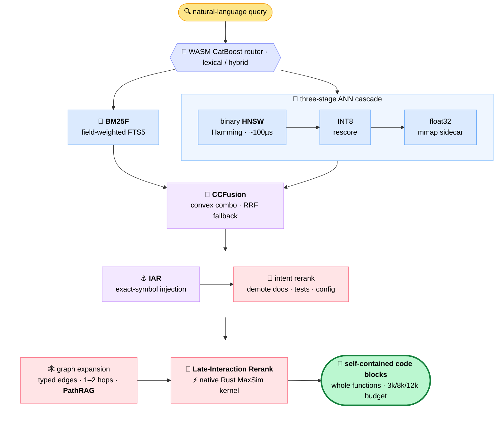

<div align="center">


### *Maybe grep isn't all you need…*

**A local-first hybrid code-search engine built for AI coding agents.**
Semantic + lexical + structural search over your working tree, GPU-accelerated local inference,
and an evolved system prompt that teaches your agent to use it all — even on plain CPU.

[](https://www.npmjs.com/package/sweet-search)
[](LICENSE)
[](package.json)
[](#platform-support)
[](#-gpu-accelerated-indexing-fully-local)

</div>

---

Your AI agent burns most of its tokens *looking* for code: grep, read, grep again, read more.
**sweet-search** replaces that loop with six purpose-built tools that return ranked, self-contained answers —
backed by a Rust/WASM engine, ColBERT-style late interaction, a code knowledge graph, and an index that
updates itself as you type.

<div align="center">

**10.2×** ripgrep's median grep speed &nbsp;·&nbsp; **2.9 ms** warm queries &nbsp;·&nbsp; **47×** faster reranking kernels &nbsp;·&nbsp; **0** API keys

<sub>measured in-repo — sources in [Benchmarks](#-benchmarks)</sub>

</div>

## ✨ Highlights

- **Hybrid retrieval** — BM25F lexical + dense semantic + structural graph signals, fused per query by a CatBoost router running in WASM
- **Agent-native by design** — token-budgeted output tiers, an MCP server, and a GEPA-evolved system prompt installed into Claude Code, Codex, Gemini CLI, and Cursor with one command
- **Indexed grep, ~10× ripgrep** — a sparse n-gram prefilter skips the files that provably can't match
- **ColBERT-style reranking, locally** — per-token MaxSim late interaction on hand-written SIMD kernels
- **Runs on anything** — Apple Metal, CUDA, CoreML Neural Engine, or plain CPU via INT8 ONNX; same engine, auto-selected
- **Never stale** — a reconcile daemon keeps the index converged with your *working tree*, uncommitted edits included
- **Fits in RAM** — INT4-quantized binary index segments and memory-mapped HNSW
- **Local-first** — all models run on-device; nothing is sent anywhere, ever

## 📚 Table of Contents

<table>
<tr>
<td width="22%" valign="top">

**GET STARTED**

[🚀 Quickstart](#-quickstart)<br>
<sub>three commands to a searchable repo</sub>

[🖥️ Platform Support](#platform-support)<br>
<sub>macOS · Linux · WASM fallback</sub>

</td>
<td width="27%" valign="top">

**USE IT**

[🧰 The Six Tools](#-the-six-tools)<br>
<sub>search · grep · find · semantic · trace · read</sub>

[🧠 The Evolved Agent Prompt](#-an-agent-prompt-that-was-evolved-not-written)<br>
<sub>GEPA-optimized search discipline</sub>

[🔌 Works With Your Agent](#-works-with-your-agent)<br>
<sub>MCP · Claude Code · Codex · Gemini · Cursor</sub>

</td>
<td width="27%" valign="top">

**UNDER THE HOOD**

[⚡ GPU-Accelerated Indexing](#-gpu-accelerated-indexing-fully-local)<br>
<sub>candle · fused kernels · cAST chunking</sub>

[🔄 An Index That Never Goes Stale](#-an-index-that-never-goes-stale)<br>
<sub>reconcile daemon tracks your working tree</sub>

[🦀 The Native Engine Room](#-the-native-engine-room)<br>
<sub>four Rust crates + TurboQuant compression</sub>

</td>
<td width="24%" valign="top">

**THE RECEIPTS**

[📊 Benchmarks](#-benchmarks)<br>
<sub>full-corpus MRR, no distractor shortcuts</sub>

[🙏 Prior Art & Acknowledgements](#-prior-art--acknowledgements)<br>
<sub>the shoulders we stand on</sub>

[📄 License](#-license)<br>
<sub>Apache-2.0</sub>

</td>
</tr>
</table>

## 🚀 Quickstart

```bash
npm install -g sweet-search

cd your-repo
sweet-search init     # one-time: downloads local models, wires up your agent
sweet-search index    # builds the index — GPU-accelerated where available

sweet-search "where do we validate JWT tokens?"
```

That's it. `init` is idempotent and SHA256-verifies every model binary; re-running it is always safe.
From then on the index maintains itself — edit, save, search.

> **Latest release: v2.5.5** — the agent-mode preview tier now defaults to a 3k token budget (was 4k):
> same accuracy and usefulness in a 4-model paired sweep, ~11–15% cheaper per query. Already on an
> older install? `npm install -g sweet-search` again to pick it up.

<details>
<summary><b>Setup options & details</b></summary>

```bash
sweet-search init --wizard          # interactive: shows your hardware, recommends a model tier
sweet-search init --profile core    # lexical-only, no model downloads (CI-friendly)
sweet-search init --li-model edge   # compact late-interaction model for constrained machines
sweet-search uninstall              # clean removal: models, caches, config — never your code
```

- **Requirements:** Node ≥ 18. macOS (arm64/x64) and Linux (x64/arm64) ship native binaries; other platforms fall back to WASM/JS automatically.
- **Footprint:** CPU-only hosts download a few hundred MB of INT8 models; GPU hosts add ~1.2 GB of FP32 backbones (skipped automatically where they'd be useless); M3+ Macs can additionally fetch a ~3.2 GB CoreML cascade for Neural Engine acceleration. Everything lands in `~/.cache/sweet-search/models/` and is used strictly on-device.
- **Agent wiring:** init injects the tool-routing system prompt into `CLAUDE.md` (and `AGENTS.md`, `GEMINI.md`, Cursor rules via flags), registers a session-start prewarm hook so your first query hits a warm daemon, and installs a `/sweet-index` skill in Claude Code.
- **What gets indexed:** what you'd expect — `.gitignore` is respected, `node_modules`/build dirs/minified artifacts are denied, files over 1 MB skipped, with a `.sweet-search-ignore` for extra rules.

</details>

## 📊 Benchmarks

> [!WARNING]
> ⚠️ **THESE NUMBERS ARE STALE — TREAT THEM AS A FLOOR, NOT THE CURRENT SCORE.** ⚠️
> Several results below were measured on builds that predate major accuracy work
> (late-interaction correctness fixes, HNSW tuning, the May 2026 ranking overhaul).
> Every benchmark is being re-run on the current engine and this table will be
> replaced with fresh numbers. Until then, expect the real results to be **higher**.

Every number below is the **`ss-search` pipeline end-to-end** — the same binary you install, querying
against the **full corpus** (no 99-distractor shortcuts), measured at 26–41 ms p50 on an M3 Max.

| Benchmark | What it tests | Queries | MRR@10 |
|-----------|---------------|--------:|-------:|
| **GenCodeSearchNet** | NL→code, 6 languages | 6,000 | **86.6** |
| **M2CRB** | multilingual NL→code (ES/PT/DE/FR → Py/Java/JS) | 2,814 | **60.2** |
| CoSQA (test split) | web queries → Python | 500 | 97.0 |
| CoSQA+ | web queries → Python, multi-match | 20,604 | 72.1 |
| CLARC | NL→C/C++ (systems code) | 1,245 | 67.4 |
| AdvTest † | adversarially renamed Python | 1,000 | 91.5 |
| CoIR † | 10 datasets, 14 languages | 4,500 | 57.3 |

**GenCodeSearchNet: the strongest result published anywhere, as far as we can tell.** The benchmark's
own paper tops out at MRR ≤ 0.42 for its fine-tuned baselines (and ≤ 0.10 on the cross-lingual subsets),
with zero-shot OpenAI Ada-2 at 0.79–0.94 — and those are measured against **99 random distractors per
query**. sweet-search scores **0.866**, retrieving from the entire 6,000-document corpus.

**M2CRB: best published number, no fine-tuning.** The benchmark paper's best model — a CodeBERT
*fine-tuned on the task's training mix* — reaches 52.7 (auMRRc, a metric averaged over smaller retrieval
pools). sweet-search reaches **60.2 full-corpus MRR@10 out of the box**, on Spanish, Portuguese, German,
and French queries.

<details>
<summary><b>Methodology, staleness flags & systems numbers</b></summary>

- **Reproduction:** result artifacts live in `eval/results/`; rerun via `eval/run_all.js`.
- **Protocol note:** published baselines for GCSN and CoSQA-style benchmarks typically rank the gold snippet against 99 sampled distractors. All sweet-search numbers rank against the full benchmark corpus — strictly harder.
- **† Staleness:** AdvTest and CoIR were last run on the February 2026 build — before the late-interaction correctness fixes, HNSW tuning, and the May ranking work. They likely understate the current engine; re-runs are queued. CoSQA/M2CRB are from the April build; GCSN, CoSQA+, and CLARC are current (May 2026).
- **Honesty corner:** CrossCodeEval — cross-file *completion context* retrieval, a different task than NL search — sits at 0.12. We don't optimize for it and report it anyway.
- Dates and per-language breakdowns: [`docs/BENCHMARKS_EXPLAINED.md`](docs/BENCHMARKS_EXPLAINED.md).

Systems performance, measured in-repo:

| What | Result | Source |
|------|--------|--------|
| Indexed grep vs ripgrep | **10.2× faster** at the median (8.5–17.7× across 5 repos, 353 realistic queries, 1 ms p50 — identical match counts on every query) | [`docs/GREP_INDEXING_STRATEGY.md`](docs/GREP_INDEXING_STRATEGY.md) |
| Warm query latency (native CLI) | **2.9 ms** warm · 108 ms cold | [`docs/INIT_STRATEGY.md`](docs/INIT_STRATEGY.md) |
| MaxSim rerank kernels | **1.26 s → 27 ms** for a 231-candidate pass (47× native Rust; 16× WASM SIMD) | [`docs/MAXSIM_OPTIMIZATION.md`](docs/MAXSIM_OPTIMIZATION.md) |
| HNSW tuning for code | **−33%** search p50, **+5.9 pp** recall@200 | [`docs/HNSW_APPROACH.md`](docs/HNSW_APPROACH.md) |
| Indexing memory | peak JS heap **785 MB → 213 MB** | [`docs/DISK_FLUSHING_STRATEGY.md`](docs/DISK_FLUSHING_STRATEGY.md) |
| CoreML cascade (M3 Max) | **18% faster** full indexing vs the Metal baseline | [`docs/INIT_STRATEGY.md`](docs/INIT_STRATEGY.md) |

</details>

## 🧰 The Six Tools

Six small tools, one shared index. Each returns ranked, deduplicated, token-budgeted output designed
to be *consumed by an agent* — a useful answer, not a wall of matches to scroll through.

| Tool | What you give it | What you get back |
|------|------------------|-------------------|
| 1. [`ss-search`](#tool-ss-search) | a natural-language query | ranked, **self-contained code blocks** |
| 2. [`ss-grep`](#tool-ss-grep) | an exact regex/literal | `file:line` hits, **ranked** |
| 3. [`ss-find`](#tool-ss-find) | a regex **+** a query | regex matches, **semantically re-ranked, as code blocks** |
| 4. [`ss-semantic`](#tool-ss-semantic) | a file **+** a question | just the **relevant spans** of that file |
| 5. [`ss-trace`](#tool-ss-trace) | a symbol | **callers + callees + impact**, in one call |
| 6. [`ss-read`](#tool-ss-read) | a file (± line range) | exact bytes **+ symbol metadata** |

<a id="tool-ss-search"></a>
### 1. 🔍 `ss-search` — hybrid search powerhouse

A hybrid search pipeline with late interaction reranking that returns actual code blocks.

SOTA in various published [`benchmarks`](#-benchmarks).



<sub>↑ The diagram traces the **hybrid** route. A pure-lexical query — or a literal file path — short-circuits at the router straight to BM25F, skipping the vector cascade and fusion.</sub>

| Stage | What it actually does |
|-------|-----------------------|
| 🧭 **Route** | **WASM-exported CatBoost** · lexical / hybrid · **~10 µs** routing · low-confidence → max-recall hybrid |
| 🧬 **Retrieve** | • **Lexical** — **BM25F** over field-weighted FTS5 (name 10× · signature 5× · alias 4× · doc 1×)<br/>• **Embed** — query vectorized by the local **CodeRankEmbed** model (swappable for Voyage / Jina / Codestral)<br/>• **Vector cascade** — binary **HNSW** (Hamming, 64-byte, ~100 µs) → INT8 rescore → exact float32 from a memory-mapped sidecar |
| 🔀 **Fuse** | • **CCFusion** — convex-combine both rankings · per-route weights · quantile-normalized<br/>• **MMR** (λ=0.9) diversity pass over the fused list<br/>• auto **RRF** (k=60) fallback on degenerate score distributions |
| ⚓ **Anchor** | • **IAR** (Identifier Anchor Retrieval) — a real symbol in the query fires an exact-name code-graph lookup that injects that entity, even when the encoder ranked it too low |
| 🎯 **Intent Rerank** | • demote docs / tests / config when you want implementation<br/>• log-scaled call-site boosts surface the most-referenced function |
| 🕸️ **Graph Expansion** | • typed-edge walks (`imports`/`extends`/`calls`/`uses`) · adaptive 2-hop on the AST graph · edges picked by intent<br/>• **PathRAG** flow pruning + degree normalization → hubs can't dominate |
| 🧮 **Late interaction Rerank** | • Query embedded per-token by **LateOn-Code** (149M; a 17M **edge** variant auto-selected on low-RAM hosts)<br/>• **MaxSim** against the pre-indexed quantized token vectors<br/>• native Rust+Rayon MaxSim kernel ⚡ · WASM-SIMD fallback (1.26 s → 27 ms on a 231-candidate rerank) |
| 📦 **Package** | • entity-aware expansion → whole functions (imports, docstrings, decorators)<br/>• same-file overlap demotion → diverse, non-overlapping spans<br/>• auto-selected **3k / 8k / 12k** token budget |

> 💡 **What surprises people:** the paper-grade HNSW tuning isn't on a roadmap — it *ships, on by default*. Heuristic neighbor selection (Algorithm 4), `M0 = 2M` on layer 0, shuffled insertion order, discovery-rate **adaptive early termination**, and **adaptive ef** are all live, on a denser graph (M=64 · efC=800 · efS=400) than most vendors ship.

> 🏎️ **Why it's quick:** a native Rust + Rayon **MaxSim kernel** (1.26 s → 27 ms on a 231-candidate rerank, 47× over scalar; 16× WASM-SIMD fallback) · a memory-mapped float32 sidecar that skips SQL on the rescore hot path · zero-GC binary HNSW (typed-array heaps + generation-stamped visited lists) · int4-quantized token vectors (**TurboQuant** — ~11× smaller on disk) · and a warm daemon that answers in a single NAPI call — no process is ever forked.

<details>
<summary><b>Design choices &amp; honesty</b></summary>

- **Quality priors:** every chunk carries a 0–1 prior from test proximity, git recency, symbol centrality (PageRank), comment density, and complexity — production code surfaces, stale fixtures sink.
- **Community structure:** a canonical **Leiden** pass detects code communities on the entity graph at index time, feeding vocabulary prewarming and structural signals — the engine understands your modules, not just your directories.
- **Multilingual:** 14 languages get full tree-sitter AST treatment; a 39-config registry covers 70+ extensions beyond that. Router features handle camelCase/snake_case decomposition, CJK density, and German compounds.
- **Long-query rescue:** wordy NL queries that FTS5 would tokenize into an unsatisfiable `AND` fall back to multi-query BM25F + RRF — one query per content keyword, fused.
- **Near-duplicate dedup:** a SimHash + MinHash-LSH pass (Jaccard τ=0.9) clusters copy-paste and vendored code at index time; aliases reuse their exemplar's vectors and skip *both* the bi-encoder and late-interaction encoding.
- **A negative result we ship anyway:** we built a full cross-encoder rerank cascade behind an adaptive confidence gate, measured it on our eval sets — and it didn't beat MaxSim at 3× the latency. So it ships **disabled** (`SWEET_SEARCH_CASCADE_ENABLED=true` to try it). We'd rather ship the faster path than a fancier diagram.
- **Budget tiers:** the expensive 8k/12k tiers are tuned to fire on ~1–5% of queries — the default stays cheap. Force one with `--full` / `--xl`, or a mode with `--mode lexical|semantic|hybrid|pattern`.
- Also available as `sweet-search "<query>"` on the CLI and the `search` MCP tool.

</details>

<a id="tool-ss-grep"></a>
### 2. `ss-grep` — grep, minus every wasted millisecond

```bash
ss-grep "parseRetryAfter" -k 10
```

**10.2× faster than ripgrep end-to-end at the median** — measured across **353 realistic queries on 5 real repos**
(range 8.5–17.7× per repo, 1 ms p50), with **identical match counts on every single query**. Three things buy that:

- **A sparse n-gram index** (inspired by [Cursor's fast-regex-search](https://cursor.com/blog/fast-regex-search) and GitHub's Blackbird): instead of a fixed trigram table, gram boundaries adapt to *your* codebase's character-pair frequencies, so common trigrams get absorbed into longer, more selective grams.
- **Regex-AST literal extraction + SIMD intersection**: required substrings are pulled from the pattern's syntax tree, posting lists are intersected with NEON/SSE2 block merges (galloping search for skewed sizes), and only the files that *can* match — typically 0.1–5% of the corpus — see the real regex.
- **Fully in-process**: verification runs on Rust's regex crate with Rayon across all cores, inside the warm daemon, in a single NAPI call. No child process is ever spawned — zero fork/exec, zero pipe I/O, zero JSON re-parsing.

Hits come back **ranked and scored**, so an agent can trust the top one and stop.

<details>
<summary><b>More</b></summary>

- Full methodology, per-repo table, and the optimization log: [`docs/GREP_INDEXING_STRATEGY.md`](docs/GREP_INDEXING_STRATEGY.md).
- Regexes with no extractable literals fall back to native grep over the indexed file set; fixed-string and glob queries use a ripgrep fallback.

</details>

<a id="tool-ss-find"></a>
### 3. `ss-find` — ColGrep, on a faster engine

```bash
ss-find "token refresh logic" --regex "refresh.*[Tt]oken"
```

Inspired by LightOn's [ColGrep](https://github.com/lightonai/next-plaid/tree/main/colgrep) — regex precision,
semantically ranked — but rebuilt on our own substrate:

- The regex stage runs on the **same indexed sparse-gram engine as `ss-grep`** (in-process, no subprocess), not a filesystem scan.
- The ranking stage scores candidates with **per-token MaxSim over pre-indexed late-interaction embeddings** — no model inference over documents at query time — on our custom kernels: native Rust + Rayon takes a 231-candidate MaxSim pass from **1.26 s down to 27 ms** (WASM SIMD fallback at 16×).
- Regex tokens are merged into the semantic query, so the ranking sees both what you typed and what you matched.
- Like `ss-search`, it answers with **ranked, self-contained code snippets** — not bare `file:line` — so the find *and* the read collapse into one tool call. In our 30-question agent-workflow eval that eliminated **every follow-up read** and cut tokens **25.4%** vs a grep + read workflow, at quality parity (gap of 0.01 on a 5-point scale).
- On the 60-query pattern benchmark, MaxSim ranking lifts MRR@10 to **0.45** vs **0.11** for raw grep ordering — 4× more likely the right hit lands on top.

<details>
<summary><b>More</b></summary>

- Requires the late-interaction index (built by default; `--li-model none` disables pattern mode).
- Also available as `sweet-search --mode pattern` and via the `search` MCP tool's `regex` argument.

</details>

<a id="tool-ss-semantic"></a>
### 4. `ss-semantic` — hybrid retrieval, scoped to one file

```bash
ss-semantic src/auth/session.ts "where does the cookie get its expiry?"
```

You know the file; this finds the lines. Every indexed chunk of the file is scored by **three independent
signals** — BM25-style lexical term match, exact symbol-name match (weighted 1.5×), and ColBERT-style
MaxSim over late-interaction token embeddings — fused with **Reciprocal Rank Fusion** (k=60), with
symbol-less fragment chunks demoted 0.85× so real definitions win ties. The top spans are then
**re-read from disk** (±2 context lines, overlapping spans merged), so the answer is filesystem ground
truth even mid-edit; if the file is newer than its index entry you get an explicit staleness warning.

The useful answer: just the relevant spans with line numbers — not the whole file through your context window.

<details>
<summary><b>More</b></summary>

- Unindexed files degrade gracefully to a plain read. Defaults: top 5 spans, relevance threshold 0.4, 8k-char cap.
- Also available as `sweet-search read-semantic` and the `read-semantic` MCP tool.

</details>

<a id="tool-ss-trace"></a>
### 5. `ss-trace` — graph algorithms, not grep guesswork

```bash
ss-trace processOrder --in src/orders/service.py
```

One call returns a symbol's **callers, callees, and transitive impact paths** from the AST-derived code
graph (entities + typed `calls`/`imports`/`extends`/`uses` edges, persisted in SQLite at index time).
Ranking fuses three signals:

- **Query-time Personalized PageRank** via Forward Push — a *local* algorithm that spreads mass directionally from your target symbol and touches only the neighborhood it reaches, never the whole graph;
- **Index-time edge-weighted global PageRank** (damping 0.85), precomputed into a `page_rank` column — a function called from five sites carries five units of mass, and it costs *zero* at query time;
- **Structural heuristics** — relationship type, depth, exported-API status, fan-in — with penalties for test-only and external paths.

Because the graph is prebuilt, the global ranking is precomputed, and the personalized walk is local,
a full three-section trace costs milliseconds. The relation word (`callers` / `callees` / `impact`)
re-weights how the response token budget is split; `--in` disambiguates duplicate names; `--depth`
bounds impact traversal (1–4).

<details>
<summary><b>More</b></summary>

- Honest caveat: call-graph extraction is precise but incomplete on highly dynamic code (bare-name dispatch, metaprogramming) — traces can be sparse there, and the agent prompt teaches a recovery strategy for exactly that case.
- Also available as `sweet-search trace` and the `trace` MCP tool.

</details>

<a id="tool-ss-read"></a>
### 6. `ss-read` — exact bytes, with the index's knowledge attached

```bash
ss-read src/db/pool.js 120 180
```

A read tool that is **filesystem-grounded by construction**: bytes come straight from disk (never from
the index, so never stale), but each indexed file arrives annotated with its **cAST chunk metadata** —
symbol name, entity type, signature, line span — joined from the AST chunk index. The agent gets the
code *and* the structural map of what it's looking at in one call: cite, navigate, or trace next
without another search.

<details>
<summary><b>More</b></summary>

- The CLI/MCP form scales it up: `sweet-search read <file...>` (and the `read` MCP tool) batches **1–20 files in a single call**, each with the same symbol metadata — twenty files for the price of one tool invocation.

</details>

> The `ss-*` wrappers ship in the npm package and are what the installed agent prompt drives. Every
> capability is equally available as `sweet-search` CLI subcommands and as MCP tools — see
> [Works With Your Agent](#-works-with-your-agent).

## 🧠 An Agent Prompt That Was Evolved, Not Written

Giving an agent six tools is easy. Getting it to *stop grepping in circles* is not.

`sweet-search init` installs a ~1k-token system prompt that encodes a complete search discipline —
and it wasn't hand-written. It was **evolved with a GEPA-style optimization loop**: reflective mutation
by one model family, scored on a dual Pareto front (accuracy × cost) across two *different* production
targets, then validated on held-out probes and on **model families that were never part of the
optimization**, and finally hand-hardened with a correctness editing pass.

What it teaches:

- **Cheapest tool first** — hold an exact identifier? One `ss-grep`, trust the top hit, stop. No semantic search "just to confirm."
- **Trust the ranking** — confirm with at most one narrow read, never a re-run of a hit that already matched.
- **Absence is an answer** — two complementary empty probes (one semantic, one lexical) settle a negative; no third synonym, no `find`/`ls` spiral.
- **No raw-shell escape** — the #1 token-waster we found in trajectory analysis is agents abandoning the index for dozens of raw `grep`/`find` calls after one empty result. The prompt closes that door explicitly.
- **A reasoning checkpoint** — before a third probe, the agent must state what it has established and what its blind spot is.

<details>
<summary><b>How it was validated</b></summary>

- **Optimization targets:** two frontier model families in production harnesses (Claude Code and Codex-style CLIs), scored jointly so the prompt can't overfit to one model's quirks.
- **Selection:** dual Pareto fronts over per-probe accuracy and measured cost; candidates gated by paraphrase-invariance (the prompt's behavior must survive rewording).
- **Held-out discipline:** a dev probe set for iteration, a held-out set checked only at milestones, and a sealed vault set opened exactly once. Joint maximin on held-out: **0.988**; out-of-distribution probes: **0.95+**; vault: **0.963** — 2.5 pp below held-out, well inside the pre-registered 15% acceptance gate.
- **Held-out model families (HOMP):** the final prompt passed on two model families from different vendors that were never used during evolution — evidence the routing rules generalize, not memorize.
- All figures are from the in-repo evaluation program (internal probe suites; see [`docs/PHASE7.md`](docs/PHASE7.md)); the benchmark suite that will make these externally reproducible is in progress.
- Installation is idempotent and marker-delimited: re-running `init` updates the managed block in `CLAUDE.md` / `AGENTS.md` / `GEMINI.md` / `.cursor/rules` without touching anything else you wrote.

</details>

## ⚡ GPU-Accelerated Indexing, Fully Local

All inference is on-device, in Rust, via [candle](https://github.com/huggingface/candle) — with the
attention path swapped for **fused kernels tuned per backend**, and an honest CPU story for machines
with no accelerator at all.

| Your hardware | What runs |
|---------------|-----------|
| Apple Silicon (M1+) | candle **Metal**, BF16, fused SDPA attention |
| Apple Silicon (M3+) | … plus a **CoreML Neural Engine cascade** (~18% faster full indexing, measured on M3 Max) |
| NVIDIA GPU (SM 7.0+) | candle **CUDA**; **flash-attention** on Ampere+ |
| Anything else | **ONNX Runtime INT8** — optimized CPU path, ~139 MB embedding model, no GPU weights downloaded |

Before a single token is embedded, files are chunked by **[cAST](https://arxiv.org/abs/2506.15655)** —
structure-aware chunking over real **tree-sitter ASTs**. A recursive split-then-merge greedily packs
adjacent sibling AST nodes into a chunk until the size cap, and recurses *into* nodes too big to fit —
so every chunk is whole code: a function, a class, a contiguous run of declarations. Never a function
sliced mid-body, never a string split mid-literal. 14 languages get true AST grammars (JS/TS/TSX,
Python, Go, Rust, Java, C, C++, Ruby, PHP, Kotlin, Swift, C#); a 39-config regex registry extends
structure-aware chunking to 70+ file extensions beyond those. Each chunk carries its symbol name,
entity type, signature, and line span — the metadata that feeds the code graph, `ss-read`'s
annotations, and the self-contained answers everywhere else.

<details>
<summary><b>What's actually custom here</b></summary>

- **Surgical attention swap:** we vendor the upstream model implementations (NomicBERT for embeddings, ModernBERT for late interaction) and replace only the attention forward pass — an MLX-ported fused SDPA kernel on Metal, `candle-flash-attn` with varlen packing on CUDA Ampere+, and byte-for-byte upstream math on CPU so the fallback is provably identical.
- **A silent-NaN bug, found and fixed:** Apple's Metal SDPA kernel downcasts attention masks to F16, which saturates the standard `f32::MIN` mask to `-Inf` and quietly produces NaN on padded rows — collapsing retrieval quality. We clamp the mask and serialize Metal command-buffer submissions (concurrent submission corrupts outputs on shared queues). Details in [`crates/sweet-search-native/src/inference/`](crates/sweet-search-native/src/inference/).
- **CoreML cascade:** 18 pre-traced `.mlpackage` variants (bucketed by sequence length) dispatched to the Apple Neural Engine through an Objective-C shim; oversized batches fall through to Metal. Gated to M3+ because on M1/M2 the ANE doesn't beat its own compile overhead — we measured, so it's off there.
- **GPU off the event loop:** inference runs as napi `AsyncTask` on libuv worker threads, so tokenization and SQLite writes overlap GPU compute instead of stalling behind it.
- **Pipelined indexing:** while batch *N+1* embeds, batch *N*'s vectors stream into SQLite through zero-copy buffer views; full rebuilds write to a temp file and atomically swap, so a crash never leaves you serving half an index.
- **Models:** CodeRankEmbed (768-d, code-specialized) for embeddings; LateOn-Code (ModernBERT) for per-token late interaction, in a full-fidelity `standard` and a compact `edge` variant (~9× smaller FP32 backbone; ~2× smaller on the INT8 CPU path).

</details>

## 🔄 An Index That Never Goes Stale

Most code indexes rot the moment you start typing. sweet-search ships a **reconcile daemon** that
keeps every tier of the index converged with your **working tree** — uncommitted edits included —
without you ever running a command.

- **Save → searchable** at the next reconcile tick — auto-tuned per machine between 15 s and 300 s, typically 15–60 s on a warm, idle box
- **Tracks the filesystem, not git** — unstaged and uncommitted changes are first-class; deleted or newly-gitignored files disappear from results automatically
- **Atomic by construction** — every tick publishes all five index tiers (float HNSW, binary HNSW, late-interaction segments, sparse-gram, code graph) through a single fsync-renamed epoch manifest, so a query never sees a half-updated index
- **No-op edits cost almost nothing** — content hashing collapses byte-identical rewrites and editor touch events into skipped re-encoding work

<details>
<summary><b>Deep dive</b></summary>

- **Baseline gate:** the daemon never plays first-index-builder. It verifies a full-indexer fingerprint (epoch manifest + merkle config fingerprint + the vectors DB it names) before touching anything, and reports `waiting_for_initial_index` otherwise — no corrupted partial baselines.
- **One admission policy:** the full indexer and the reconciler share a single `createAdmissionPolicy` module (include globs → deny list → `.sweet-search-ignore` → 1 MB size cap → batched `git check-ignore`), so the two paths cannot drift.
- **Orphan sweep:** files that are deleted, newly excluded, or newly oversized get tombstoned across every tier; the index converges to exactly what a fresh full rebuild would produce.
- **Self-maintenance:** per-tier health watermarks (tombstone fraction, stale-doc ratio, delta ratio) schedule low-priority background compaction in a separate worker — the index stays fast over months without a manual rebuild.
- **Worktree-safe:** a worktree stamp plus a single-writer lockfile prevent two daemons from silently interleaving index histories across git worktrees.
- **Resource-polite:** ticks are budgeted (≤50 files / ≤2 s CPU per tick), run CPU-only (the GPU is reserved for cold full indexing), and the interval auto-tunes from load average, churn, and backlog.
- `sweet-search reconcile status` / `reconcile inspect <path>` explain exactly what the daemon thinks and why. Opt out any time with `SWEET_SEARCH_RECONCILE_V2=0`.

</details>

## 🦀 The Native Engine Room

Four Rust crates do the heavy lifting, each with a graceful fallback so the engine runs everywhere:

| Crate | What it does |
|-------|--------------|
| `sweet-search-native` | candle GPU/CPU inference, sparse-gram grep engine, SIMD posting-list intersection, SimHash/MinHash-LSH dedup, HuggingFace tokenizers — all over zero-copy NAPI |
| `wasm-maxsim` | a hand-written WASM SIMD kernel computing ColBERT MaxSim in ~4 KB (~1.6 KB gzipped), with fused INT8 dequantization inside the SIMD pipeline plus a 4-bit nibble-packed path |
| `wasm-router` | the 498-tree CatBoost query router, loop-unrolled, zero-allocation |
| `sweet-search-cli` | a native CLI that talks to a warm search daemon over a per-project Unix socket — **2.9 ms** measured warm-path queries |

<details>
<summary><b>Deep dive</b></summary>

- **MaxSim, three speeds:** scoring auto-selects the best available tier — native Rust + Rayon across all cores (**47×** vs baseline JS in our microbenchmark), portable WASM SIMD (**16×**), or a norm-cached pure-JS fallback (3.5×). Equivalent rankings, any platform.
- **SIMD set intersection:** posting-list intersection dispatches per-pair — galloping search when one list is ≥8× smaller, 4-wide NEON/SSE2 block merges for balanced lists, scalar merge for small ones — following the Lemire/Clausecker line of work.
- **Dedup at index time:** near-duplicate chunks are fingerprinted (64-bit SimHash + 128-permutation MinHash), clustered with banded LSH + union-find, then *re-validated pairwise* against the exemplar so transitive weak links can't glue unrelated clusters together. Duplicates skip embedding entirely — and at query time the best-matching *sibling* can take the exemplar's slot, so collapsing copies never hides the right answer.
- **Per-project warm daemon:** the CLI derives an isolated socket path from an FNV-1a hash of the project root, auto-starts the server on first use, and falls back to pure JS where no native binary exists (measured: 2.9 ms warm / 108 ms cold / 64.7 ms JS fallback).
- **Native tokenization:** the official HuggingFace `tokenizers` crate over NAPI — batched, cached, no Python anywhere in the stack.

</details>

### 🗜️ TurboQuant: an index that fits in RAM

A 17k-document codebase's late-interaction index weighed **1.34 GiB** as JSON-encoded INT8. The binary
segment format cut the same index to **~396 MiB** (3.4× of pure ASCII bloat, gone) — and the INT4
default packs token vectors at half a byte each on top of that. Laptop-sized, fully in RAM.

<details>
<summary><b>Deep dive</b></summary>

- **INT4 by default:** per-token min/scale quantization with nibble packing (two values per byte), A/B-tested against the INT8 baseline with no meaningful retrieval regression before becoming the default.
- **SSLX binary segments:** the index persists as ~10k-document binary segment files with structured headers and CRC32 footers — a crash costs you at most one segment, not the index.
- **Three-stage retrieval:** a binary HNSW (Hamming distance over 64-byte binarized vectors, ~32× smaller than float HNSW) produces candidates in ~100 µs, INT8 rescoring narrows them, and a float32 sidecar rescores the final pool — speed without giving up top-result quality.
- **Memory-mapped HNSW:** the float graph index loads via `mmap` (USearch `view()`), contributing **0 MB** to the V8 heap at search time; the OS reclaims pages under pressure.
- **Streaming indexer:** vectors stream from SQLite cursors instead of materializing in arrays — peak JS heap during indexing dropped from ~785 MB to ~213 MB, with 30-second fsync-ordered checkpoints bounding crash loss. The OOM cliff that used to appear above ~200k chunks is gone; large repos index comfortably on an 8 GB machine.
- Tuned HNSW parameters and zero-GC search internals (typed-array heaps, generation-stamped visited lists) cut search p50 by 33% while *raising* recall@200 by 5.9 pp in our internal evaluation ([`docs/HNSW_APPROACH.md`](docs/HNSW_APPROACH.md)).

</details>

## 🔌 Works With Your Agent

sweet-search meets your agent wherever it is — shell tools, MCP, or injected instructions:

```jsonc
// .claude/mcp.json — that's the whole integration
{
  "mcpServers": {
    "sweet-search": {
      "command": "npx",
      "args": ["sweet-search-mcp", "--project-root", "/absolute/path/to/your/repo"]
    }
  }
}
```

- **MCP server** — 8 tools (`search`, `trace`, `read`, `read-semantic`, `index`, `health`, `repo-map`, `vocab-prewarm`), 2 resources, 2 prompts; all search tools declared read-only and idempotent
- **Harness injection** — `init` writes the evolved system prompt into Claude Code, Codex (`--codex`, including session hooks), Gemini CLI (`--gemini`), and Cursor (`--cursor`) from one canonical source
- **Repo maps for sub-agents** — the `repo-map` tool returns a PageRank-ranked symbol overview squeezed into any token budget, perfect for briefing a delegated agent
- **Warm from the first query** — a SessionStart hook pre-launches the search daemon so models, vocabulary, and indexes are loaded before you ask anything

<details>
<summary><b>Deep dive</b></summary>

- **Tool routing enforcement (opt-in):** `init --enforce-tools` denies the native Grep tool in Claude Code and installs a hint hook nudging native Read toward `ss-read`/`ss-semantic` — for when you want the discipline guaranteed, not suggested.
- **`/sweet-index` skill:** a Claude Code slash command for a full GPU-aware reindex, installed by init.
- **Vocabulary prewarm:** `sweet-search prewarm-vocab` mines your repo's real identifiers, detects code communities (Leiden), and pre-warms all three search modes so even the first semantic query of a session is cache-warm.
- **Honest committed-state:** init never writes machine-specific absolute paths into committed settings files, and all instruction injection is marker-delimited and reversible.

</details>

<a id="platform-support"></a>

## 🖥️ Platform Support

| Platform | Engine | Acceleration |
|----------|--------|--------------|
| macOS arm64 (Apple Silicon) | native | Metal (M1+) · CoreML Neural Engine (M3+) |
| macOS x64 (Intel) | native | ONNX Runtime INT8 CPU |
| Linux x64 (glibc) | native | CUDA (SM 7.0+, flash-attn on Ampere+) or INT8 CPU |
| Linux arm64 (glibc) | native | CUDA (Jetson Orin / Grace) or INT8 CPU |
| Windows | — | via WSL2 (= Linux x64) |
| Everything else | WASM/JS fallback | runs everywhere Node ≥ 18 runs |

Native binaries are selected automatically at `npm install` time via optionalDependencies — no flags, no postinstall scripts to debug. Every native fast path has a WASM or JS fallback that produces the same results.

## 🙏 Prior Art & Acknowledgements

sweet-search stands on a lot of shoulders, and we'd rather name them than pretend otherwise:

- **[ColBERT](https://arxiv.org/abs/2004.12832)** (Khattab & Zaharia) — late interaction; **[LightOn](https://huggingface.co/lightonai)** for the LateOn-Code models and the ColGrep concept our pattern mode parallels
- **[ripgrep](https://github.com/BurntSushi/ripgrep)** (BurntSushi) — the bar for grep, and our verification baseline
- **GitHub's [Blackbird](https://github.blog/engineering/the-technology-behind-githubs-new-code-search/)** — the sparse n-gram indexing idea we tuned per-codebase
- **[candle](https://github.com/huggingface/candle)** & **[MLX](https://github.com/ml-explore/mlx)** — Rust ML and the fused SDPA kernels we build on; **[HuggingFace tokenizers](https://github.com/huggingface/tokenizers)**
- **[Aider](https://github.com/Aider-AI/aider)** — the repo-map idea, here rebuilt on a real knowledge graph
- **[USearch](https://github.com/unum-cloud/usearch)** — memory-mapped HNSW; **Malkov & Yashunin** for [HNSW](https://arxiv.org/abs/1603.09320) itself
- **[CatBoost](https://catboost.ai/)** — the query router model; **Traag et al.** for the [Leiden algorithm](https://arxiv.org/abs/1810.08473); **Cormack et al.** for RRF; **[PathRAG](https://arxiv.org/abs/2502.14902)** for flow-pruned graph expansion; **[cAST](https://arxiv.org/abs/2506.15655)** for structure-aware chunking
- **[GEPA](https://arxiv.org/abs/2507.19457)** — the reflective evolutionary prompt-optimization paradigm behind our agent prompt
- **[nomic-ai](https://huggingface.co/nomic-ai)** — the CodeRankEmbed embedding model

## 📄 License

[Apache-2.0](LICENSE) © [PanonIT](https://panonit.com)

---

<div align="center">

**If sweet-search saves your agent's tokens, a ⭐ helps other agents' humans find it.**

</div>
