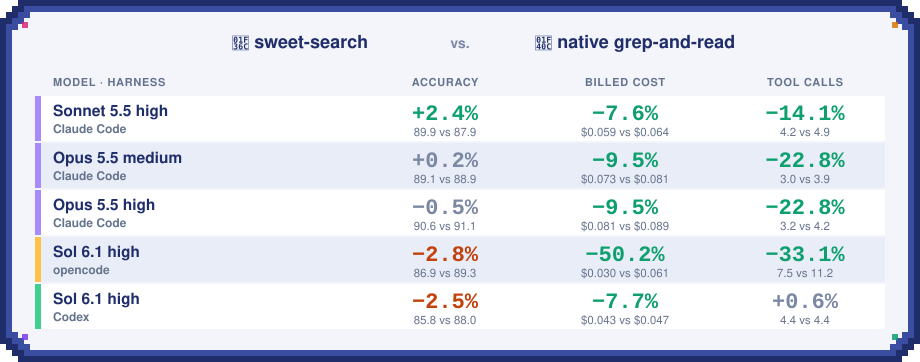
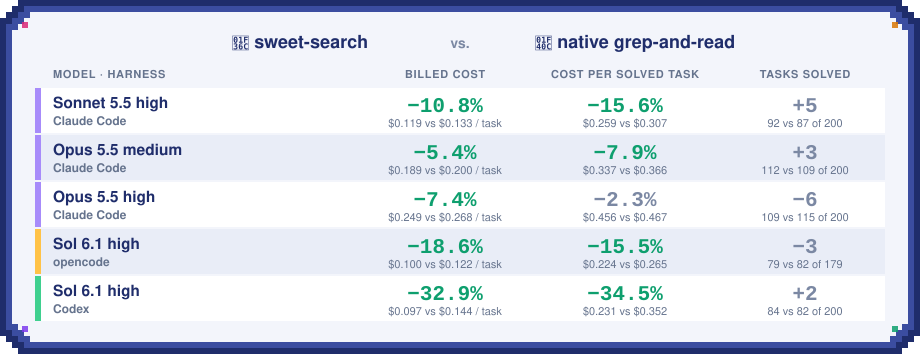
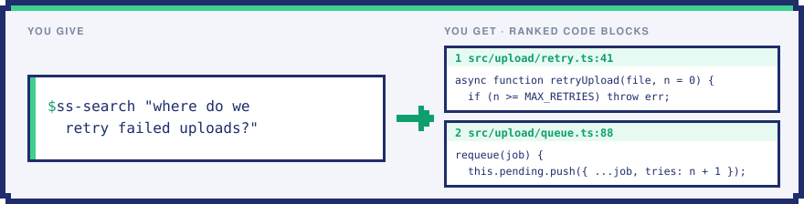
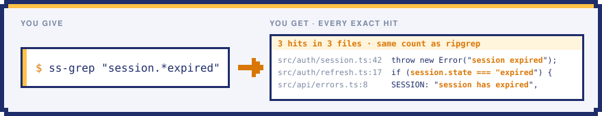
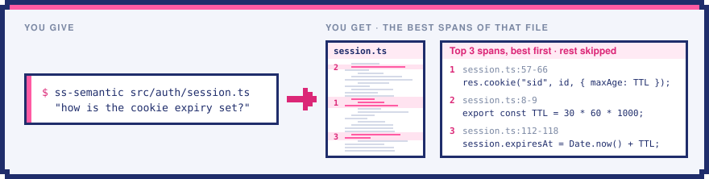
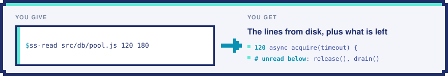

<div align="center">


## **🍬 Local code search for AI coding agents 🍬**<br>


Six fast, purpose-built tools made for *Claude Code*, *Codex* & friends 👀

Every coding agent today reaches for grep + Read by reflex. *sweet-search* challenges the narrative 😎

[](https://www.npmjs.com/package/sweet-search)
[](https://github.com/mrsladoje/sweet-search/stargazers)
[](LICENSE)
[](package.json)
[](#platform-support)
[](#-gpu-accelerated-indexing-fully-local)

</div>

---

## ✨ Highlights

<table>
<tr>
<td width="50%" valign="top">

💰 **7–27% cheaper agent runs**<br>
<sub>on 200 real engineering tasks · up to 45% fewer tool calls · solve rate statistically tied</sub>

</td>
<td width="50%" valign="top">

⚡ **Saves your time**<br>
<sub>faster retrieval than classic grep-and-read · reduced walltime of agentic tasks</sub>

</td>
</tr>
<tr>
<td width="50%" valign="top">

🔄 **Index once, then forget it**<br>
<sub>one command, GPU-accelerated · updates itself as you edit, uncommitted changes included</sub>

</td>
<td width="50%" valign="top">

🔒 **100% local**<br>
<sub>no API keys · no cloud · no Docker · your code never leaves your machine</sub>

</td>
</tr>
</table>

---

## 📚 Table of Contents

<table>
<tr>
<td width="22%" valign="top">

**GET STARTED**

[🚀 Quickstart](#-quickstart)<br>
<sub>three commands to a searchable repo</sub>

[🖥️ Platform Support](#platform-support)<br>
<sub>macOS · Linux · WASM fallback</sub>

</td>
<td width="27%" valign="top">

**USE IT**

[🧰 The Six Tools](#-the-six-tools)<br>
<sub>search · grep · find · semantic · trace · read</sub>

[🧠 The Evolved Agent Prompt](#-an-agent-prompt-that-was-evolved-not-written)<br>
<sub>GEPA-optimized search discipline</sub>

</td>
<td width="27%" valign="top">

**UNDER THE HOOD**

[⚡ GPU-Accelerated Indexing](#-gpu-accelerated-indexing-fully-local)<br>
<sub>candle · fused kernels · cAST chunking</sub>

[🔄 An Index That Never Goes Stale](#-an-index-that-never-goes-stale)<br>
<sub>reconcile daemon tracks your working tree</sub>

</td>
<td width="24%" valign="top">

**THE RECEIPTS**

[📊 Benchmarks](#-benchmarks)<br>
<sub>agent cost savings · engine speed · full-corpus MRR</sub>

[🧭 Where sweet-search Fits](#-where-sweet-search-fits)<br>
<sub>honest wins & trade-offs vs peers</sub>

[🙏 Prior Art & Acknowledgements](#-prior-art--acknowledgements)<br>
<sub>the shoulders we stand on</sub>

[📄 License](#-license)<br>
<sub>Apache-2.0</sub>

</td>
</tr>
</table>

## 🚀 Quickstart

**Requirements:** Node.js 22+ on macOS (Apple silicon or Intel) or Linux (x64 or ARM64). On Windows, run sweet-search inside WSL2.

```bash
npm install -g sweet-search

cd your-repo
sweet-search init     # one-time: downloads local models, wires up your agent
sweet-search index    # builds the index — GPU-accelerated where available

sweet-search "where do we validate JWT tokens?"
```

That's it. From then on, the index updates itself as you work.

*Claude Code:* keep the `sweet-search` output style selected. Claude Code needs it to use sweet-search reliably. `init` turns it on for you; start a new session or run `/clear` afterwards.

To uninstall 😢:

```bash
sweet-search uninstall        # this repo only
sweet-search uninstall --all  # everything: all repos, models, and the CLI
```

<details>
<summary><b>Setup options & details</b></summary>

<br/>

```bash
sweet-search init --wizard          # interactive: shows your hardware, recommends a model tier
sweet-search init --profile core    # lexical-only, no model downloads (CI-friendly)
sweet-search init --li-model edge   # compact late-interaction model for constrained machines
sweet-search init --agents          # also configure AGENTS.md for Codex/OpenCode
sweet-search init --no-claude --agents # streamlined AGENTS-only configuration
sweet-search uninstall --dry-run    # preview cleanup for the current repo
```

- **Footprint:** CPU-only hosts download a few hundred MB of INT8 models; GPU hosts add ~1.2 GB of FP32 backbones (skipped automatically where they'd be useless); M3+ Macs can additionally fetch a ~3.2 GB CoreML cascade for Neural Engine acceleration. Everything lands in `~/.cache/sweet-search/models/` and is used strictly on-device.
- **Claude Code wiring (default):** init leaves `CLAUDE.md` untouched, writes the verbatim evolved guide to `.claude/rules/sweet-search.md`, installs `.claude/output-styles/sweet-search.md`, and selects it in `.claude/settings.json`. It also registers a session-start prewarm hook and installs the `/sweet-index` skill.
- **Output-style conflicts:** init never silently replaces another selected style. It still installs the Sweet Search style so it appears under `/config`, then emits a warning. A higher-priority `.claude/settings.local.json` selection is also detected and reported. Select `sweet-search`, then run `/clear` or restart Claude Code.
- **Codex/OpenCode wiring:** pass `--agents` to place the same verbatim guide directly in `AGENTS.md`. Use `--no-claude --agents` when AGENTS.md is the only integration you want; `--codex` additionally installs Codex's project prewarm hook.
- **What gets indexed:** what you'd expect — `.gitignore` is respected, `node_modules`/build dirs/minified artifacts are denied, files over 1 MB skipped, with a `.sweet-search-ignore` for extra rules.

### MCP and other integrations

The CLI is the default contact surface. To also register the MCP server, run
`sweet-search init --mcp`, or add it to `.mcp.json` yourself:

```jsonc
{
  "mcpServers": {
    "sweet-search": {
      "command": "npx",
      "args": ["-y", "sweet-search-mcp", "--project-root", "/absolute/path/to/your/repo"]
    }
  }
}
```

- **MCP server:** 8 tools (`search`, `trace`, `read`, `read-semantic`, `index`, `health`, `repo-map`, `vocab-prewarm`), 2 resources, 2 prompts. All search tools are declared read-only and idempotent.
- **Repo maps for sub-agents:** the `repo-map` tool returns a PageRank-ranked symbol overview that fits any token budget, for briefing a delegated agent.
- **Vocabulary prewarm:** `sweet-search prewarm-vocab` mines your repo's real identifiers, detects code communities (Leiden), and pre-warms all three search modes, so the first semantic query of a session is already cache-warm.
- **Committed files stay portable:** init never writes machine-specific absolute paths into committed settings files. All instruction injection is marker-delimited and reversible.

### Init flags

| Flag | Behavior |
|---|---|
| `--profile core\|full` | Select lexical-only core or the full model-backed profile. |
| `--li-model standard\|edge\|none` | Select the late-interaction model tier or disable it. |
| `--search-reranking auto\|on\|off` | Control search-time late-interaction reranking. |
| `--wizard` | Choose model and reranking settings interactively. |
| `--verify-deep` | Load modules and verify checksums after setup. |
| `--force` | Re-download models even when cached. |
| `--build-coreml-cascade` | Build the optional CoreML cascade locally on eligible Apple silicon. |
| `--skip-coreml-cascade` | Skip fetching or building the CoreML cascade. |
| `--skip-dedup` | Skip near-duplicate-detection readiness checks. |
| `--skip-cuda` | Disable the CUDA backend even when available. |
| `--skip-prewarm-hook` | Do not register the Claude/Codex session-start prewarm hook. |
| `--agents` | Also write the verbatim guide to `AGENTS.md` for Codex/OpenCode. |
| `--codex` | Add the Codex prewarm hook and project feature flag; implies `--agents`. |
| `--codex-enable-global-hooks` | Advanced opt-in: also enable hooks in the user-level Codex config. |
| `--no-claude` | Write nothing under `.claude/`; combine with `--agents` for AGENTS-only setup. |
| `--gemini` | Also write `GEMINI.md` (sharing `AGENTS.md` when enabled). |
| `--cursor` | Also write `.cursor/rules/sweet-search.mdc`. |
| `--symlink-instruction-files` | Explicitly use the default `GEMINI.md` symlink behavior. |
| `--no-symlink-instruction-files` | Use a regular `GEMINI.md` import instead of a symlink. |
| `--no-agent-instructions` | Skip all agent policy and Claude output-style installation. |
| `--mcp` | Also register the project MCP server; the CLI remains the default contact surface. |
| `--no-cli` | With `--mcp`, give agents the MCP-specific guide and remove the CLI-specific Claude output style. |
| `--enforce-tools` | Optional strict Claude mode: deny native Grep and hint native Read. |
| `--verbose`, `-v` | Print additional setup diagnostics. |
| `--help`, `-h` | Show the complete CLI help. |

### Uninstall flags and cleanup

| Flag | Behavior |
|---|---|
| `--all` | Remove sweet-search from this machine: every repo where `init` ran, the shared model cache, and the npm package. |
| `--dry-run` | Preview all detected removals. |
| `--force` | Skip the confirmation prompt. |
| `--help`, `-h` | Show uninstall help. |

`sweet-search uninstall` removes Sweet Search's rule, output style and active
selection, AGENTS/GEMINI/Cursor instruction blocks, project hooks and skill,
MCP registration, enforcement/reminder artifacts, and `.sweet-search/` from the
current repo. The shared model cache stays for your other repos. It
preserves user-authored content. Generic Codex `[features] hooks = true` flags
are left in place because other tools may share them, and an otherwise-empty
settings file may remain as `{}`.

</details>

## 📊 Benchmarks

We measure sweet-search four ways — from how much it helps a real agent down to raw engine throughput:

<table>
<tr>
<td width="50%" valign="top">

🤖 **① [Code-retrieval](#bench-code-retrieval)** *(agent-in-the-loop)*<br>
<sub>Does it make a real coding agent **cheaper and more useful** when it searches your repo? Paired against each model's own grep-and-read loop.</sub>

</td>
<td width="50%" valign="top">

🛠️ **② [Task-completion](#bench-task-completion)** *(frozen held-out)*<br>
<sub>Does cheaper, denser context **compound** across multi-step engineering tasks? 200 SWE-rebench tasks, three harnesses, 1,200 paired rollouts.</sub>

</td>
</tr>
<tr>
<td width="50%" valign="top">

📄 **③ [Paper-type IR](#bench-paper-type)** *(academic)*<br>
<sub>The standard NL→code retrieval suites (GCSN, M2CRB, CoSQA…), full-corpus MRR@10.</sub>

</td>
<td width="50%" valign="top">

⚡ **④ [Engine speed](#bench-engine-speed)**<br>
<sub>Raw systems numbers — grep throughput, query latency, rerank kernels, HNSW.</sub>

</td>
</tr>
</table>

---

<a id="bench-code-retrieval"></a>
### 🤖 1. Code-retrieval benchmarks — *the agent-in-the-loop test*

One variable changes: **how the agent searches a real repository.**

- 🍬 **sweet-search:** the model gets our [GEPA-evolved search discipline](#-an-agent-prompt-that-was-evolved-not-written) and search tools.
- 🐌 **Native:** the same model uses its built-in grep-and-read loop.

Same tasks, same judge, paired probe-for-probe.

<div align="center">



<sub>sealed vault · exact paired results · five representative profiles · full 11-cell matrix and held-out/OOD replication below</sub>

</div>

**The headline, in four claims:**

- 💰 **Cheaper where the agent thrashes** — up to **−34%** realized cost on Codex; **−18 to −32%** across the GPT-5.5 / opencode / bare-API harnesses.
- 🔧 **Fewer round-trips** — up to **−56%** tool calls, significant on **9 of 11** cells.
- ✨ **More useful per response** — **+0.18 to +0.31** on a 5-dimension usefulness score, and *still* denser when length-matched (significant on **8 of 11** cells).
- 🎯 **Accuracy held — and lifted on the weak** — a statistical tie on flagship models (saturated at 0.94–0.99), and **+3 pp** (up to **+8 pp** out-of-distribution) on weaker models like GLM-5.1 and DeepSeek.

<details>
<summary><b>📋 Full per-harness results & how it's measured</b></summary>

<br/>

The win is **harness-adaptive**: where the native loop is disciplined (Claude Code) it shows up as *denser, more useful context per token*; where it thrashes (Codex floods 30k+ tokens of its own grep output into context) it shows up as a *large cost and tool-call cut*. Either way, **final-answer accuracy never significantly regresses**.

| 🧰 Native agent harness | 💰 Realized cost | 🔧 Tool calls | ✨ Useful content / response | 🎯 Final accuracy |
|---|---:|---:|---:|:--|
| 🤖 **Codex** (GPT-5.5) | **−30 to −34%** | **−44 to −56%** | +0.06 → +0.17 ↑ | tie *(saturated)* |
| 🐚 **opencode** (GPT-5.5 / GLM-5.1) | **−18 to −22%** | −15 to −49% | **+0.23 to +0.31** ↑ | tie |
| 🔌 **bare API** (GPT-5.5 / GLM / DeepSeek) | −15 to −32% ᵃ | −15 to −33% | +0.08 to +0.24 ↑ | tie · **+3 pp on weak models** |
| 🟣 **Claude Code** (Sonnet / Opus) | −10% to +14% ᵇ | −5 to −33% | +0.18 to +0.29 ↑ | tie |

<sub>↑ "Useful content / response" is the per-response delta on a 5-dimension usefulness score (answer-grounding · workable-code · navigability · edit-locality · sufficiency), 0–1 scale. "tie" = final-answer correctness statistically indistinguishable (saturated in the 0.94–0.99 band on flagships).<br>ᵃ the two cheapest bare models cost fractions of a cent either way (GLM +27% of $0.008; DeepSeek −15% of $0.004). ᵇ Opus −5/−10%; Sonnet +8–14%, which is ≈1¢ on a flat-rate subscription for a richer answer.</sub>

**Denser, not just longer.** The usefulness lift survives **length-matching** — comparing sweet-search and native responses of *equal token length*, sweet-search's content is significantly higher on **8 of 11** cells. The validated single-number usefulness composite (grounding × content × density) is significant on **all 11** sealed cells.

- **What's being compared:** the installed `sweet-search` agent prompt + tools vs. the *same model* using only its built-in file-reading and shell-grep tools. Not a different model — the same model, with and without sweet-search.
- **Design:** 11 model×harness cells. **Sealed vault** (n=60/arm, the pre-registered primary) opened once; plus **held-out** (n=30) and **out-of-distribution** (n=40) sets for generalization. Stratified, fixed-seed splits.
- **Judging:** 3-judge panel (DeepSeek-V4-flash + Gemini-3.1-flash-lite + MiniMax-M2.7), paired by probe, 20k-sample bootstrap CIs, **Benjamini–Hochberg FDR** multiplicity correction across each metric family. We report family-level survival counts, never a single cherry-picked cell.
- **What survives FDR (vault):** useful-content **10/11**, density-composite **11/11**, length-matched content **8/11**, fewer-tool-calls **9/11**. Generalization (held-out + OOD): content **17–18/20**, fewer calls **14/20**.
- **The token fact that drives everything:** sweet-search's footprint is nearly constant (~1.3k–3.3k tokens) because the tool responses are capped; native's footprint is whatever the model decides to grep — up to **37k tokens** on Codex. That single fact is what drives the cost and tool-call gaps.
- **Honest caveats we keep attached:** (1) accuracy **ties** on flagship models — it is *not* an accuracy win there, it's saturated; the accuracy gains are real only on weaker models. (2) The two weakest cells for *length-matched* density (Codex-low, DeepSeek) are correct-sign but underpowered — Codex's responses are so token-divergent that too few equal-length pairs exist to reach significance, and DeepSeek is simply under-powered. Those are honest non-victories, not wins.
- Full methodology and per-cell tables: [`docs/PHASE7.md`](docs/PHASE7.md).

</details>

---

<a id="bench-task-completion"></a>
### 🛠️ 2. Task-completion benchmarks — *does it compound?*

Retrieval quality is necessary but not sufficient. Cheaper, denser context only matters if it
**compounds across a real, multi-step engineering task** — find the code, understand it, change it,
don't break anything. This suite measures exactly that: **resolve-rate and cost on SWE-rebench-style
multi-file tasks**, sweet-search-wired vs. the same model's native loop.

One variable changes, again: **how the agent searches.** Same model, same tasks, same grader, paired
per task. The harnesses run **as they ship** — no tools disabled, no delegation switched on or off.

<div align="center">



<sub>frozen held-out set · 200 tasks · 1 rep · 1,200 rollouts · gpt-5.6-luna · opened once</sub>

</div>

**The headline, honestly:**

- 💰 **Cheaper on every harness, by 2% to 31%** — measured on the tasks **both arms solved**, so it's
  like-for-like and not sweet giving up early on hard tasks.
- 🤝 **Resolve rate is a tie, and sweet is slightly behind** — −3, −6 and −7 tasks out of 200. None
  significant (McNemar p = 0.66, 0.18, 0.12). **This is not a resolve-rate win and we don't claim one.**
- 🪆 **The saving scales with how much the harness delegates** — Claude Code's native arm fired
  **1,191 subagent requests against sweet-search's 150**, and that gap *is* the 31%. Codex has no
  subagent tier and shows 2.1%.
- 🧭 **Fewer tool calls where it matters** — 19.6 vs 35.8 on Claude Code, 19.0 vs 24.4 on opencode.

<details>
<summary><b>📋 Full per-harness results & how it's measured</b></summary>

<br/>

| 🧰 Harness | 💰 Cost, same tasks solved | 💰 Cost, all tasks | 🎯 Resolved | 🪆 Subagent requests | 🔧 Tool calls |
|---|---:|---:|:--|---:|---:|
| 🟣 **Claude Code** | **−31.0%** ᵃ | −27.4% | 66 / 69 · *p=0.66* | **150 / 1,191** | 19.6 / 35.8 |
| 🐚 **opencode** | **−7.7%** | −11.5% | 65 / 71 · *p=0.18* | not instrumented | 19.0 / 24.4 |
| 🤖 **Codex** | **−2.1%** ᵇ | −6.8% | 72 / 79 · *p=0.12* | none (no subagent tier) | 10.6 / 8.8 |

<sub>All figures sweet-search / native. ᵃ Claude Code is the only leg priced from a **real OpenRouter
invoice** (10,371 generation records, 0 unresolved), sidechain-**inclusive**, because its `rows.json`
nulls cost arm-asymmetrically and would reverse the sign. ᵇ Codex ran on a ChatGPT subscription, so
**nothing was billed** — its dollars are list-price-equivalent, not an invoice. opencode is
list-price ledger with 0 nulls on both arms.</sub>

**The mechanism, stated plainly.** Sweet-search's main-loop spend is close to native's (−6.1% on
Claude Code). The gap is delegation: native spawns subagents to explore a repo it can't navigate
cheaply, and each one is a fresh context that gets billed. Better retrieval removes the reason to
delegate. That's why the same product shows 31% on a harness with a subagent tier and 2% on one
without — and why we quote a **range, not one number**.

- **What's compared:** the installed `sweet-search` agent prompt + tools vs. the *same model* using
  its built-in file-reading and shell-grep loop. The sweet-search system prompt says nothing about
  subagents or delegation — it only routes code search through `ss-*`.
- **Design:** 200 tasks × 2 arms × 1 rep × 3 harnesses = **1,200 rollouts**. Tasks drawn from
  SWE-rebench V1+V2, admitted only if the official gold patch grades FULL in the exact run
  environment (a "green ledger" gate), and re-verified per run.
- **Isolation:** every rollout runs in its own mount/PID/network jail with an SNI-allowlist egress
  proxy — the agent can reach the model API and nothing else. No GitHub, no package registries.
  Escape attempts are counted, not assumed to be zero.
- **Grading:** the official SWE-bench/SWE-rebench Docker evaluator, `FAIL_TO_PASS` +
  `PASS_TO_PASS`. A patch that produces no test evidence is marked **ungradeable**, never scored
  zero. Final run: **0 ungradeable, 0 zero-call rollouts, 0 run errors** across all 1,200.
- **Honest caveats we keep attached:** (1) **1 rep** — a single cell on this bench has been observed
  swinging 3/3 → 1/3 → 2/3 across identical runs, so the solve column is a point estimate.
  (2) **37 of 199 stamped tasks (18.6%) are naming lotteries** — the hidden test needs an identifier
  the reference patch invented, which no amount of retrieval can recover. (3) Three legs, three cost
  bases, only one a real invoice — **do not pool the dollar figures**. (4) The three solve deltas all
  lean the same way (−3, −6, −7); individually noise, collectively a hint that sweet-search may cost
  a little accuracy, and we'd rather say so than round it to zero.

</details>

---

<a id="bench-paper-type"></a>
### 📄 3. Paper-type retrieval benchmarks — *academic NL→code IR*

Every number below is the **`ss-search` pipeline end-to-end** — the same binary you install — run
against the **full benchmark corpus** (no 99-distractor shortcuts), **zero-shot** (we never
fine-tune on these tasks). Where a benchmark's queries are docstrings, we strip the docstring out of the
indexed code so the query can't trivially match itself — the standard retrieval protocol.

We're SOTA in June 2026 on 3/4 attempted benchmarks at HARDER settings (running on full pool) than most other attempts!

| 📚 Benchmark | 🔍 What it tests | # Queries | 📂 Pool | 🎯 MRR@10 | 🏆 SOTA? |
|-----------|---------------|---------:|---------:|--------:|--------:|
| 🌐 **GenCodeSearchNet** | NL→code, 6 languages | 6,000 | full 6,000 | **86.6** | YES ✅ |
| 🐍 **CoSQA** | web queries → Python | 500 | full 6,267 | **65.5** | ✅ (zero-shot) |
| 🗺️ M2CRB | multilingual NL→code (ES/PT/DE/FR → Py/Java/JS) | 5,795 | full 5,795 | 54.0 | YES ✅ |
| 🛡️ AdvTest | adversarial, identifier-obfuscated Python | 19,210 | full 19,210 | 51.4 | NO ❌ |

<sub>SOTA = best result we can find in the published literature as of June 2026; cross-metric/protocol comparisons are spelled out per benchmark below.</sub>

#### 🌐 GenCodeSearchNet → `86.6` &nbsp;·&nbsp; 🏆 SOTA in June 2026
- **The BEST PUBLISHED number we can find, anywhere**
- The benchmark's own paper caps at **MRR ≤ 0.42** for fine-tuned baselines (≤ 0.10 cross-lingual); even zero-shot OpenAI Ada-2 reaches 0.79–0.94 — but **all of it against a tiny 99-distractor pool**.
- We score **0.866 against the entire 6,000-document corpus** — *a strictly harder setting* — and **zero-shot**. 🔥

#### 🐍 CoSQA → `65.5` &nbsp;·&nbsp; 🥇 Zero-shot SOTA in June 2026
- **Beats EVERY PUBLISHED zero-shot model**
- Canonical setup: 500 real web queries → the fixed **6,267-code database**, no fine-tuning.
- Clears the strongest zero-shot results out there — CodeSage-Large `47.5` · OpenAI text-embedding-3-large `55.4` · OASIS `55.8` — and goes **toe-to-toe with *fine-tuned* CodeBERT / GraphCodeBERT** (64.7 / 67.5). 💪
- <sub>CoSQA has known label noise, so we read the absolute height with a pinch of salt.</sub>

#### 🗺️ M2CRB → `54.0` &nbsp;·&nbsp; 🏆 SOTA in June 2026
- **the BEST PUBLISHED number we can find, anywhere** — and zero-shot
- 🇪🇸 Spanish · 🇵🇹 Portuguese · 🇩🇪 German · 🇫🇷 French → Python / Java / JavaScript.
- The paper's best — a CodeBERT **fine-tuned on the task** — reaches **52.7 auMRRc**, a metric that *averages over easier, smaller pools* (so `auMRRc ≥ full-pool MRR` for any model). Our **54.0 is full-pool MRR@10** over all 5,795 functions in one pool — a **strictly harder** measure, cleared with **no fine-tuning**. 🔥

#### 🛡️ AdvTest → `51.4` &nbsp;·&nbsp; 🧪 **our honest worst case — and we publish it anyway**
- Adversarial obfuscation (`def Func(arg_0):`) deletes the lexical + graph signals our hybrid feeds on — yet we still **beat the classic fine-tuned baselines** (CodeBERT `27` · GraphCodeBERT `35` · UniXcoder `41`), and our stack *still lifts our own encoder ~3pp even here*.
- 🔍 **Full transparency:** we could **not** reproduce the often-cited `59.5` for the bare CodeRankEmbed encoder — the *reference FP32 model* scores **54.7** on our leak-free corpus, our shipped INT8 build **51.4**. The gap is stricter preprocessing + INT8 quantization, **not** the retrieval pipeline. We report exactly what we measured.

<details>
<summary><b>Methodology, protocol & honesty notes</b></summary>

<br/>

- **Reproduction:** result artifacts live in [`eval/results/`](eval/results/); rerun via `eval/run_all.js`. The canonical full-pool loaders are in `eval/download_data.py`.
- **Full corpus, not distractors.** Published baselines for GCSN- and CoSQA-style benchmarks typically rank the gold against 99 sampled distractors; every number here ranks against the benchmark's *full* corpus (6k–19k candidates) — strictly harder.
- **Zero-shot + docstring-stripped.** We never fine-tune on these tasks. For docstring-derived benchmarks (AdvTest, M2CRB) we strip the docstring from the indexed code — otherwise the NL query matches itself verbatim (a no-strip AdvTest run scores a meaningless 0.98). This is the standard protocol; it is also why our AdvTest is lower than naïve setups that leave the docstring in.
- **Dev/held-out split.** Our ranking work iterates against a fixed dev split of each benchmark (e.g. GCSN: 600 dev + 400 held-out per language, stratified, seed=42) and treats the remainder as held-out, inspected aggregate-only at milestones. The table figures are full-corpus runs — they include the dev portion we tuned against; a held-out-only breakdown ships with the next results refresh.
- **What we deliberately don't claim yet.** CoIR (official metric NDCG@10 over per-subtask corpora up to ~1M docs), CoSQA+ (multi-positive, MAP-primary), and CLARC (per-group pools) use protocols and metrics our single-pool MRR@10 harness doesn't currently match. Rather than publish apples-to-oranges numbers, we omit them; faithful per-subtask CoIR (NDCG@10) runs are queued.
- **M2CRB** — the paper's metric is *auMRRc* (area under the MRR-vs-pool-size curve; best published **52.7**, fine-tuned). Because that area averages over easier small pools, `auMRRc ≥ full-pool MRR` for any model — so our **54.0 full-pool MRR@10** (all 5,795 functions, zero-shot) clears their best on a strictly harder measure. No one publishes a plain full-corpus MRR@10 on M2CRB, so ours is the best available.
- **AdvTest honesty note.** We could not reproduce the commonly-cited 59.5 for the bare CodeRankEmbed encoder on our corpus: the reference FP32 model scores 54.7 on our leak-free, docstring-stripped, full-19,210 setup, and our shipped INT8 build 51.4. We report our measured numbers and the reference check rather than the leaderboard figure.
- **Honesty corner:** CrossCodeEval — cross-file *completion-context* retrieval, a different task than NL search — sits at 0.12. We don't optimize for it and report it anyway.

</details>

---

<a id="bench-engine-speed"></a>
### ⚡ 4. Engine speed — *systems benchmarks, measured in-repo*

<div align="center">

**10.2×** ripgrep's median grep &nbsp;·&nbsp; **2.9 ms** warm queries &nbsp;·&nbsp; **47×** MaxSim kernels &nbsp;·&nbsp; **−33%** HNSW search p50

</div>

| ⚙️ What | 📈 Result | 📄 Source |
|------|--------|--------|
| ⚡ Indexed grep vs ripgrep | **10.2× faster** at the median (8.5–17.7× across 5 repos, 353 realistic queries, 1 ms p50 — identical match counts on every query) | [`docs/GREP_INDEXING_STRATEGY.md`](docs/GREP_INDEXING_STRATEGY.md) |
| ⏱️ Warm query latency (native CLI) | **2.9 ms** warm · 108 ms cold | [`docs/INIT_STRATEGY.md`](docs/INIT_STRATEGY.md) |
| 🧮 MaxSim rerank kernels | **1.26 s → 27 ms** for a 231-candidate pass (47× native Rust; 16× WASM SIMD) | [`docs/MAXSIM_OPTIMIZATION.md`](docs/MAXSIM_OPTIMIZATION.md) |
| 🧠 HNSW tuning for code | **−33%** search p50, **+5.9 pp** recall@200 | [`docs/HNSW_APPROACH.md`](docs/HNSW_APPROACH.md) |
| 💾 Indexing memory | peak JS heap **785 MB → 213 MB** | [`docs/DISK_FLUSHING_STRATEGY.md`](docs/DISK_FLUSHING_STRATEGY.md) |
| 🍏 CoreML cascade (M3 Max) | **18% faster** full indexing vs the Metal baseline | [`docs/INIT_STRATEGY.md`](docs/INIT_STRATEGY.md) |

## 🧭 Where sweet-search Fits

Code search is a crowded space. Here's an honest read on where sweet-search wins and where it gives ground, against the trending leaders and our closest local peers.

| Capability | sweet-search | CodeGraph | GitNexus | codebase-memory | claude-context | SocratiCode |
|---|:---:|:---:|:---:|:---:|:---:|:---:|
| 100% local · zero API keys by default | ✅ | ✅ | ✅ | ✅ | ⚠️¹ | ✅ |
| No external service to run (vector DB · Ollama · Docker) | ✅ | ✅ | ✅ | ✅ | ❌ Milvus | ⚠️² |
| Embedding (semantic) search on by default | ✅ | ❌ | ⚠️³ | ✅ | ✅ | ✅ |
| ColBERT late-interaction rerank⁴ | ✅ | ❌ | ❌ | ❌ | ❌ | ❌ |
| Faster-than-ripgrep exact grep | ✅ | ❌ | ❌ | ❌ | ❌ | ❌ |
| Call-graph trace (callers · callees · impact) | ✅ | ✅ | ✅ | ✅ | ❌ | ✅ |
| Published NL→code retrieval benchmarks | ✅ | ⚠️⁵ | ❌ | ⚠️⁵ | ⚠️⁵ | ⚠️⁵ |
| Permissive license (free commercial use) | ✅ Apache-2.0 | ✅ MIT | ❌⁶ | ✅ MIT | ✅ MIT | ⚠️ AGPL-3.0 |
| *…and where sweet-search gives ground* | | | | | | |
| Native Windows | ❌⁷ | ✅ | ✅ | ✅ | ✅ | ✅ |
| Deep-AST language coverage | ⚠️ 14 (+70 via regex) | ✅ 34 | ⚠️ 16 | ✅ 162 | ⚠️ 13 | ✅ 22 |
| Org-wide, multi-repo scale | ❌ | ⚠️⁸ | ✅ | ✅ | ⚠️ | ✅ |

<sub>✅ yes · ⚠️ partial / with caveats · ❌ no. Verified September 2026; capabilities drift.</sub>

<details><summary>Footnotes</summary>

<br/>

<sub>¹ claude-context defaults to OpenAI/Voyage embeddings + Zilliz Cloud. Its local path (Milvus Lite + Ollama) needs no API key, but still runs Milvus + Ollama.<br/>² SocratiCode runs Qdrant and Ollama for you in Docker, so Docker must be running.<br/>³ GitNexus local embeddings are opt-in (`analyze --embeddings`).<br/>⁴ Outside this table, [ColGREP](https://github.com/lightonai/next-plaid) (LightOn) also runs ColBERT code search locally, as a grep-style search CLI.<br/>⁵ Reports token / cost / tool-call savings, not NL→code retrieval quality.<br/>⁶ PolyForm Noncommercial.<br/>⁷ Runs on Windows via WSL2.<br/>⁸ Indexes each project separately; one session can query several indexed projects, with no cross-repo links.</sub>

</details>

<sub>Competitors: <a href="https://github.com/colbymchenry/codegraph">CodeGraph</a> · <a href="https://github.com/abhigyanpatwari/GitNexus">GitNexus</a> · <a href="https://github.com/DeusData/codebase-memory-mcp">codebase-memory</a> · <a href="https://github.com/zilliztech/claude-context">claude-context</a> · <a href="https://github.com/giancarloerra/socraticode">SocratiCode</a> · <a href="https://github.com/lightonai/next-plaid">ColGREP</a> · <a href="https://github.com/oraios/serena">Serena</a> · <a href="https://sourcegraph.com">Sourcegraph</a> · <a href="https://github.com/continuedev/continue">Continue</a> · <a href="https://github.com/yoanbernabeu/grepai">grepai</a> · <a href="https://github.com/cocoindex-io/cocoindex-code">cocoindex-code</a></sub>

---

## 🧰 The Six Tools

Six tools that share one index. Your agent picks the one that fits the question.

<table>
<tr>
<td align="center" valign="top" width="33%">
<a href="#tool-ss-search"></a><br/>
<b>1. <a href="#tool-ss-search"><code>ss-search</code></a></b><br/>
search by meaning
</td>
<td align="center" valign="top" width="33%">
<a href="#tool-ss-grep"></a><br/>
<b>2. <a href="#tool-ss-grep"><code>ss-grep</code></a></b><br/>
exact text, fast
</td>
<td align="center" valign="top" width="33%">
<a href="#tool-ss-find"></a><br/>
<b>3. <a href="#tool-ss-find"><code>ss-find</code></a></b><br/>
a pattern, ranked by meaning
</td>
</tr>
<tr>
<td align="center" valign="top" width="33%">
<a href="#tool-ss-semantic"></a><br/>
<b>4. <a href="#tool-ss-semantic"><code>ss-semantic</code></a></b><br/>
search inside one file
</td>
<td align="center" valign="top" width="33%">
<a href="#tool-ss-trace"></a><br/>
<b>5. <a href="#tool-ss-trace"><code>ss-trace</code></a></b><br/>
who calls what
</td>
<td align="center" valign="top" width="33%">
<a href="#tool-ss-read"></a><br/>
<b>6. <a href="#tool-ss-read"><code>ss-read</code></a></b><br/>
read a file
</td>
</tr>
</table>

---

<a id="tool-ss-search"></a>
###  1. `ss-search`: hybrid code search



A hybrid search pipeline with late interaction reranking that returns actual code blocks.

SOTA on [3 of 4 academic code-search benchmarks](#bench-paper-type).


```mermaid
flowchart TD
    Q(["🔍  natural-language query"]) --> ROUTE{{"🧭 WASM CatBoost router · lexical / hybrid"}}

    ROUTE --> BM["📑 <b>BM25F</b><br/>field-weighted FTS5"]
    ROUTE --> EMB["🔢 <b>CodeRankEmbed</b><br/>dense query embedding"] --> ANN

    subgraph ANN ["🧬 three-stage ANN cascade"]
        direction LR
        BIN["binary <b>HNSW</b><br/>Hamming · ~100µs"] --> INT["INT8<br/>rescore"] --> FL["float32<br/>mmap sidecar"]
    end

    BM  --> FUSE
    ANN --> FUSE
    FUSE["🔀 <b>CCFusion</b><br/>convex combo · RRF fallback"] --> ROW1

    subgraph ROW1 [" "]
        direction LR
        IAR["⚓ <b>IAR</b><br/>exact-symbol injection"] --> INTENT["🎯 intent rerank<br/>demote docs · tests · config"]
    end

    ROW1 --> ROW2

    subgraph ROW2 [" "]
        direction LR
        GRAPH["🕸️ graph expansion<br/>typed edges · 1–2 hops · <b>PathRAG</b>"] --> MAXSIM["🧮 <b>Late-Interaction Rerank</b><br/>⚡ native Rust MaxSim kernel"] --> OUT(["🏁 <b>self-contained code blocks</b><br/>whole functions · 3k/8k/12k budget"])
    end

    classDef io    fill:#fde68a,stroke:#f59e0b,color:#000;
    classDef out   fill:#bbf7d0,stroke:#15803d,color:#000,stroke-width:3px;
    classDef route fill:#e0e7ff,stroke:#818cf8,color:#000;
    classDef lex   fill:#dbeafe,stroke:#60a5fa,color:#000;
    classDef fuse  fill:#f3e8ff,stroke:#c084fc,color:#000;
    classDef rank  fill:#ffe4e6,stroke:#fb7185,color:#000;
    classDef emb   fill:#ecfeff,stroke:#22d3ee,color:#000;

    class Q io;
    class OUT out;
    class ROUTE route;
    class EMB emb;
    class BM,BIN,INT,FL lex;
    class FUSE,IAR fuse;
    class INTENT,GRAPH,MAXSIM rank;

    style ANN  fill:#eff6ff,stroke:#93c5fd,color:#000;
    style ROW1 fill:none,stroke:none;
    style ROW2 fill:none,stroke:none;
```

<sub>↑ The diagram shows the **hybrid** route. A pure keyword query or a literal file path goes from the router straight to BM25F and skips the vector search and fusion.</sub>

<details>
<summary><b>🗺️ Diagram explained</b></summary>

<br/>

| Stage | What it actually does |
|-------|-----------------------|
| 🧭 **Route** | **WASM-exported CatBoost** · lexical / hybrid · **~10 µs** routing · low-confidence → max-recall hybrid |
| 🧬 **Retrieve** | • **Lexical:** **BM25F** over field-weighted FTS5 (name 10× · signature 5× · alias 4× · doc 1×)<br/>• **Embed:** query vectorized by the local **CodeRankEmbed** model (swappable for Voyage / Jina / Codestral)<br/>• **Vector cascade:** binary **HNSW** (Hamming, 64-byte, ~100 µs) → INT8 rescore → exact float32 from a memory-mapped sidecar |
| 🔀 **Fuse** | • **CCFusion:** convex-combine both rankings · per-route weights · quantile-normalized<br/>• **MMR** (λ=0.9) diversity pass over the fused list<br/>• auto **RRF** (k=60) fallback on degenerate score distributions |
| ⚓ **Anchor** | • **IAR** (Identifier Anchor Retrieval): a real symbol in the query fires an exact-name code-graph lookup that injects that entity, even when the encoder ranked it too low |
| 🎯 **Intent Rerank** | • demote docs / tests / config when you want implementation<br/>• log-scaled call-site boosts surface the most-referenced function |
| 🕸️ **Graph Expansion** | • typed-edge walks (`imports`/`extends`/`calls`/`uses`) · adaptive 2-hop on the AST graph · edges picked by intent<br/>• **PathRAG** flow pruning + degree normalization → hubs can't dominate |
| 🧮 **Late interaction Rerank** | • Query embedded per-token by **LateOn-Code** (149M; a 17M **edge** variant auto-selected on low-RAM hosts)<br/>• **MaxSim** against the pre-indexed quantized token vectors<br/>• native Rust+Rayon MaxSim kernel ⚡ · WASM-SIMD fallback (1.26 s → 27 ms on a 231-candidate rerank) |
| 📦 **Package** | • entity-aware expansion → whole functions (imports, docstrings, decorators)<br/>• same-file overlap demotion → diverse, non-overlapping spans<br/>• **symbol-family completion** (agent mode): generated/width families surface as a compact indexed manifest instead of truncating silently, inside the same budget<br/>• auto-selected **3k / 8k / 12k** token budget |

</details>

<details>
<summary><b>🌶️ Extra spice: what the diagram leaves out</b></summary>

<br/>

- 🧠 **A denser vector graph than most.** Our own binary HNSW raised recall@200 from 80.6% to 86.5% and got about a third faster.
- ⚡ **Native reranking.** The MaxSim math runs in Rust on all CPU cores, 47× faster than plain code.
- 📦 **A small index.** Token vectors are packed into 4 bits, which makes that index 3.4× smaller.
- 🎛️ **Quality scores.** Each chunk is scored on test proximity, git recency, call-graph centrality, comments and complexity. Production code rises and old fixtures sink.
- 🛟 **A reranker we switched off.** We built a cross-encoder too. It was 3× slower and did not beat MaxSim, so it ships disabled.

Also available as `sweet-search "<query>"` on the CLI and the `search` MCP tool. Use `--full` or `--xl` for a bigger answer, and `--mode lexical|semantic|hybrid|pattern` to pick a mode. Full details: [vector index](docs/HNSW_APPROACH.md) · [quantization](docs/LI_QUANTIZATION_STRATEGY.md).

</details>

---

<a id="tool-ss-grep"></a>
###  2. `ss-grep`: grep, minus every wasted millisecond



### ⚡ 10.2× faster than ripgrep
> Median, end to end, on 353 real queries across 5 repos (8.5–17.7× per repo, about 1 ms per query). Same match count as ripgrep on every query.

<table><tr><td>

**What makes it fast**

- 🧩 **Sparse n-gram index.** Grams are sized to your repo's own text, so each one points to few files. The idea comes from [Cursor's fast regex search](https://cursor.com/blog/fast-regex-search) and [GitHub's Blackbird](https://github.blog/engineering/architecture-optimization/the-technology-behind-githubs-new-code-search/).
- 🎯 **Literal filter.** The fixed text is pulled out of the regex, and SIMD intersects the file lists. Only 0.1–5% of files see the real regex.
- 🦀 **All in-process.** Rust regex runs on all cores inside the warm daemon. No subprocess, no pipes, no JSON parsing.

</td></tr></table>


<details>
<summary><b>More</b></summary>

<br/>

- Method, per-repo results and the optimization log: [`docs/GREP_INDEXING_STRATEGY.md`](docs/GREP_INDEXING_STRATEGY.md).
- A regex with no fixed text (for example `\w+\d`) cannot use the index, so it scans every indexed file.

</details>

---

<a id="tool-ss-find"></a>
###  3. `ss-find`: grep that knows what you meant



### 🎯 Exact matches, semantically reranked
> The idea comes from LightOn's [ColGrep](https://github.com/lightonai/next-plaid/tree/main/colgrep). We rebuilt it on the `ss-grep` index, with our own MaxSim kernel.

<table>
<tr><td colspan="2"><b>What makes it fast</b></td></tr>
<tr>
<td width="50%" valign="top">

**⚡ Built on `ss-grep`**

- The regex runs on the sparse n-gram index.
- That index makes `ss-grep` 10.2× faster than ripgrep.
- Your query is turned into embeddings at the same time.

</td>
<td width="50%" valign="top">

**🦀 Our own MaxSim kernel**

- Rust + SIMD, on all cores.
- Code embeddings are stored at index time, so no model reads your code at query time.
- 231 matches: 1.26 s in plain JS → 27 ms.
- July rewrite: another 4–6× faster.

</td>
</tr>
</table>

<details>
<summary><b>More</b></summary>

<br/>

- **Ranking:** on 60 pattern queries, MRR@10 is 0.45. Grep order gets 0.11, and search without the regex gets 0.30.
- **Agent eval (April 2026):** Claude Sonnet 4.6 answered 30 fastify questions. Versus grep + read, follow-up reads fell from 4.9 to 0 and tokens fell 25.4%, at equal quality (blind Claude Opus 4.6 judge). The prompt was tuned on these same 30 questions.
- Needs the late-interaction index, which is built by default.
- Also available as `sweet-search --mode pattern` and as the `regex` argument of the MCP `search` tool.
- Kernel details: [`docs/MAXSIM_OPTIMIZATION.md`](docs/MAXSIM_OPTIMIZATION.md).

</details>

---

<a id="tool-ss-semantic"></a>
###  4. `ss-semantic`: hybrid search inside one file



### 📍 Ask one file a question
> You already know the file. `ss-semantic` gives you only the lines that answer your question, with line numbers. The rest of the file stays out of your context.

<table>
<tr><td colspan="2"><b>How it picks the lines</b></td></tr>
<tr>
<td width="50%" valign="top">

**🧮 Three scores, one ranking**

- **Words:** BM25-style match on your terms.
- **Symbols:** exact symbol-name match, 1.5× weight.
- **Meaning:** MaxSim over LateOn-Code token embeddings.
- Reciprocal Rank Fusion merges the three lists.

</td>
<td width="50%" valign="top">

**📄 Always the live file**

- The best spans are read again from disk.
- Each span gets 2 lines of context on each side. Overlapping spans are merged.
- So you see the current code, even during an edit.
- If the file is newer than its index, you get a warning.

</td>
</tr>
</table>

<details>
<summary><b>More</b></summary>

<br/>

- **Defaults:** top 5 spans, score floor 0.4, 8,000-character limit.
- Chunks with no symbol get a 0.85× penalty, so real definitions win ties.
- A file that is not indexed falls back to a plain read.
- Also available as `sweet-search read-semantic` and as the `read-semantic` MCP tool.

</details>

---

<a id="tool-ss-trace"></a>
###  5. `ss-trace` — graph algorithms, not grep guesswork



One call returns a symbol's **callers, callees, and transitive impact paths** from the AST-derived code
graph (entities + typed `calls`/`imports`/`extends`/`uses` edges, persisted in SQLite at index time).
Ranking fuses three signals:

- **Query-time Personalized PageRank** via Forward Push — a *local* algorithm that spreads mass directionally from your target symbol and touches only the neighborhood it reaches, never the whole graph;
- **Index-time edge-weighted global PageRank** (damping 0.85), precomputed into a `page_rank` column — a function called from five sites carries five units of mass, and it costs *zero* at query time;
- **Structural heuristics** — relationship type, depth, exported-API status, fan-in — with penalties for test-only and external paths.

Because the graph is prebuilt, the global ranking is precomputed, and the personalized walk is local,
a full three-section trace costs milliseconds. The relation word (`callers` / `callees` / `impact`)
re-weights how the response token budget is split; `--in` disambiguates duplicate names; `--depth`
bounds impact traversal (1–4).

<details>
<summary><b>More</b></summary>

<br/>

- Honest caveat: call-graph extraction is precise but incomplete on highly dynamic code (bare-name dispatch, metaprogramming) — traces can be sparse there, and the agent prompt teaches a recovery strategy for exactly that case.
- Also available as `sweet-search trace` and the `trace` MCP tool.

</details>

---

<a id="tool-ss-read"></a>
###  6. `ss-read`: read a file from disk



It reads the file from disk, not from the index, so the code is always current. It also does three things for the agent:

- **Line numbers that fit the agent.** Claude Code gets `12<TAB>`, opencode and Cursor get `12:`, and Codex gets none. Each agent's edit tool expects a different format, and the wrong one can end up inside an edit.
- **A note on what is left.** If the agent reads only part of a file, it sees the names of the functions it skipped and the command to read them.
- **No double reads.** If the agent reads the same lines again, it gets a one-line reminder instead of the same code twice.

<details>
<summary><b>More</b></summary>

<br/>

- Also available as `sweet-search read` and the `read` MCP tool, with up to 20 files per call.
- Minified and generated files are refused, so the agent does not load thousands of useless tokens by mistake.
- The agent is detected automatically. To set the format yourself, use `SS_READ_GUTTER=tab|colon|none`.

</details>

---

## 🧠 An Agent Prompt That Was Evolved, Not Written

Shipping six tools is easy. Getting an agent to *stop grepping in circles* is the hard part.

So `sweet-search init` installs a ~1k-token system prompt that we **didn't write** — we *grew* it.
A GEPA-style loop mutated candidate prompts, scored each on a dual Pareto front (**accuracy × cost**)
against **two different production agents at once** — Claude Code (Sonnet) and Codex (GPT-5.5) — kept the
survivors, and repeated. A final correctness pass hardened the winner. ~1k tokens, one job: teach the
agent to search *well*.

**🎓 The six rules it encodes:**

| | Rule | What it kills |
|--|--|--|
| 🥇 | **Cheapest tool first** | Got an exact symbol? One `ss-grep`, trust the top hit, stop — no semantic search "just to confirm." |
| 🎯 | **Trust the ranking** | At most one narrow read to confirm; never re-run a hit that already matched. |
| 🚫 | **Absence is an answer** | Two empty probes (one semantic, one lexical) settle a negative — no third synonym, no `find`/`ls` spiral. |
| ⛔ | **No raw-shell escape** | The #1 token-waster in our trace analysis: agents bailing to dozens of raw `grep`/`find` calls after one miss. Door closed. |
| 📝 | **Think before you dig** | Before a third probe, the agent states what it knows and what its blind spot is. |
| 🗺️ | **Map the fix surface** | Before a visibly multi-site edit, make one mapping call and inspect the full function instead of fixing only the first match. |

**🧾 The receipts** — *held-out discipline throughout: a dev set to iterate on, a held-out set touched only at milestones, a sealed vault opened exactly once.*

| Validation gate | Result |
|--|--|
| 🎯 **Held-out** (30 probes × both agents) | joint score *(worst of the two)* **0.988** |
| 🌍 **Out-of-distribution** (8 languages never seen in the loop) | **0.952** — *every* language ≥ 0.79, zero weak spots |
| 🛡️ **Adversarial counter-probes** | **1.00 / 1.00** |
| 🔀 **Held-out model families** (never optimized on) | MiMo **0.988** · Qwen **0.980** — it generalizes, it doesn't memorize |
| 🧩 **Paraphrase robustness** (reword the prompt, same behavior) | correctness-weighted **0.95 / 0.93** |

<details>
<summary><b>🔬 How it was actually built (the honest version)</b></summary>

<br/>

- **Seeds → survivors:** 15 hand-authored seed prompts entered a reflective-evolution loop (an agent reads the *real* tool-call traces, proposes one targeted edit, we keep what helps). Operators included trajectory crossover, structural pivots, tool-name masking, and a pruner that fights prompt bloat.
- **Two targets, jointly:** every candidate was scored on **both** Claude Code/Sonnet **and** Codex/GPT-5.5 with Maximin discipline (a prompt is only as good as its *worse* target), so it can't overfit one model's quirks.
- **What actually won:** not clever phrasing — **terseness** (a shorter prompt re-sent every turn is cheaper), a **leaner tool mix** (grep/read over heavy semantic blocks that fatten the transcript), and **decisiveness on no-match** (stop spiraling). We report this plainly because it's what the traces showed.
- **The shipped lineage:** the current `p7-v1-mppppp-fs` guide is the evolved champion plus a verdict-gated trust rule and a narrowly triggered fix-surface mapping rule. The latter came from full-200 failure forensics and was retained only after targeted fix/control smokes rejected a costlier wording.
- **Held-out everything:** dev to iterate, held-out checked only at milestones, a sealed vault opened once, plus held-out *model families* (MiMo, Qwen) and a reasoning-mode replay (MiniMax **0.963**) it never trained against. Figures: [`docs/PHASE7.md`](docs/PHASE7.md) (internal probe suites; an externally-reproducible suite is in progress).
- **Idempotent install:** Claude receives the guide through its owned project rule plus output style; opt-in harnesses receive marker-delimited blocks in `AGENTS.md` / `GEMINI.md` / `.cursor/rules`. Re-run init freely: owned content updates in place and user prose is preserved.

</details>

## ⚡ GPU-Accelerated Indexing, Fully Local

> **Chunk → enrich → embed → quantize** — every step on-device and in Rust. Batches are sized to *your CPU's actual cache*, two open code-models do the encoding, and two separate quantizations make the index both **faster to build** and **small enough to live in RAM**. Zero API keys; nothing ever leaves the machine.

<table>
<tr>
<td width="50%" valign="top">

① 🧩 **[Structure-aware chunk](#idx-chunk)**<br>
<sub>cAST over tree-sitter ASTs — whole functions, never sliced mid-body</sub>

</td>
<td width="50%" valign="top">

② 🏷️ **[Enrich from structure](#idx-enrich)**<br>
<sub>deterministic preamble from the code graph — **no LLM call**</sub>

</td>
</tr>
<tr>
<td width="50%" valign="top">

③ 🤖 **[Embed — two models](#idx-embed)**<br>
<sub>dense **CodeRankEmbed** + per-token **LateOn-Code**</sub>

</td>
<td width="50%" valign="top">

④ 🗜️ **[Quantize + persist](#idx-quantize)**<br>
<sub>INT8 weights → **2× faster build** · INT4 vectors → **fits in RAM**</sub>

</td>
</tr>
</table>

**The inference engine, picked for your silicon:**

| Your hardware | What runs |
|--|--|
| 🍏 Apple Silicon (M1+) | candle **Metal**, BF16, fused SDPA attention |
| 🍏 Apple Silicon (M3+) | …​ plus a **CoreML Neural Engine cascade** — ~18% faster full index (measured, M3 Max) |
| 🟩 NVIDIA GPU (SM 7.0+) | candle **CUDA**; **flash-attention** on Ampere+ |
| 💻 No accelerator | **ONNX Runtime INT8** — tuned CPU path, 132 MB model, **zero GPU weights downloaded** |

<a id="idx-chunk"></a>
### 🧩 Chunking — every chunk is whole code, never a fixed window
- **[cAST](https://arxiv.org/abs/2506.15655)** structure-aware chunking over real **tree-sitter** ASTs: a recursive *split-then-merge* greedily packs sibling AST nodes up to the size cap and recurses *into* nodes too big to fit. So a chunk is always a **function, a class, or a contiguous run of declarations** — never a body cut in half, never a string split mid-literal.
- **14 languages** get true AST grammars — `JS · TS · TSX · Python · Go · Rust · Java · C · C++ · Ruby · PHP · Kotlin · Swift · C#` — and a **39-config regex registry** carries structure-aware chunking to **70+ more extensions**.

<a id="idx-enrich"></a>
### 🏷️ Metadata — context the encoder can actually see
- Every chunk ships its **symbol name · entity type · signature · line span** — the metadata that powers the code graph, `ss-read`'s unread-symbol hints, and the self-contained answers everywhere else.
- **Contextual enrichment:** before embedding, each chunk is prefixed with a structured preamble assembled from the AST + code graph — *file path · enclosing-scope breadcrumb · name & type · merged siblings · the imports it actually uses*. **Both** encoders see it, so a bare `getId()` still retrieves on the class and module around it.
- Our nod to **[Anthropic's Contextual Retrieval](https://www.anthropic.com/news/contextual-retrieval)** — except they prepend an *LLM-generated* summary (one model call per chunk); we derive the context **deterministically from structure**: no LLM, no per-chunk inference, regenerated for free on every reindex. **Tuned per language** from GenCodeSearchNet ablations — Python stays minimal, the Java family keeps a slug-stripped path, JS/Ruby/Go/C/C++/Rust get the full preamble where closures and imports earn their keep.

### 🧠 Cache-aware batching — we read your CPU before we batch it
- We **detect your last-level cache at runtime** — `hw.perflevel0.l2cachesize` (the 16 MB P-cluster on Apple Silicon, *not* the smaller E-cluster), Intel L3, or `/sys/.../cache` on Linux — then size every embedding batch so **one transformer layer's weights *plus* the batch's activations stay resident in cache**. No spilling to main memory mid-layer; on a long-sequence tail that's the difference between B=1 and a measured **2.1× per-chunk slowdown**.
- **Uses every core the hardware really has** — full count on ARM/Apple Silicon; x86 SMT siblings discounted because they don't scale inference linearly.
- **ORT drives the CPU path** (ONNX Runtime); GPU hosts swap in fused kernels (below). Either way inference runs off the event loop as a napi `AsyncTask`, so tokenization and SQLite writes overlap compute instead of stalling behind it.

<a id="idx-quantize"></a>
### 🗜️ Two quantizations — one buys speed, one buys size
| | **Model weights** · INT8 ORT | **Index vectors** · INT4 binary |
|:--|:--|:--|
| **Job** | build the index faster on CPU | keep the on-disk index tiny |
| **Win** | **~2× faster** indexing · 4× smaller model (**132 MB**) | LI index **1.34 GiB → ~396 MiB** · INT4 nibble-packing halves it again |
| **Fidelity** | **≥ 0.96 cosine** vs FP32 | **no measurable retrieval loss** (A/B-tested vs INT8) |

<a id="idx-embed"></a>
### 🤖 Two models — both open, both local, both code-specialized
- **[CodeRankEmbed](https://huggingface.co/nomic-ai/CodeRankEmbed)** — 768-d dense bi-encoder (137M, Apache-2.0) for first-stage recall.
- **[LateOn-Code](https://huggingface.co/lightonai/LateOn-Code)** — ModernBERT per-token **late interaction** (149M) for the rerank.
- **Edge fallback for leaner machines:** a **17M `edge` LateOn-Code** (~9× smaller FP32 backbone) auto-selects on low-RAM hosts, and the whole CPU path runs INT8 with **no GPU weights ever downloaded** — full local search on a laptop with no accelerator.

<details>
<summary><b>What's actually custom here — the kernels we hand-wrote</b></summary>

<br/>

- **Surgical attention swap:** we vendor the upstream model implementations (NomicBERT for embeddings, ModernBERT for late interaction) and replace **only the attention forward pass** — an MLX-ported fused SDPA kernel on Metal, `candle-flash-attn` with varlen packing on CUDA Ampere+, and byte-for-byte upstream math on CPU so the fallback is provably identical.
- **A silent-NaN bug, found and fixed:** Apple's Metal SDPA kernel downcasts attention masks to F16, which saturates the standard `f32::MIN` mask to `-Inf` and quietly produces NaN on padded rows — collapsing retrieval quality. We clamp the mask and serialize Metal command-buffer submissions (concurrent submission corrupts outputs on shared queues). Details in [`crates/sweet-search-native/src/inference/`](crates/sweet-search-native/src/inference/).
- **CoreML cascade:** 18 pre-traced `.mlpackage` variants (bucketed by sequence length) dispatched to the Apple Neural Engine through an Objective-C shim; oversized batches fall through to Metal. Gated to M3+ because on M1/M2 the ANE doesn't beat its own compile overhead — we measured, so it's off there.
- **Structure-routed enrichment:** the preamble (path · scope chain · symbol · siblings · imports) is assembled at index time from a code-graph line-range overlap query — never an LLM call — then routed per language family (full enriched text for JS/Ruby/Go/C-family/Rust, a slimmer path policy for Python and the Java family), every decision settled by per-language ablation rather than a global default.
- **Pipelined, crash-safe indexing:** while batch *N+1* embeds, batch *N*'s vectors stream into SQLite through zero-copy buffer views; full rebuilds write to a temp file and atomically swap, so a crash never leaves you serving half an index.

</details>

## 🔄 An Index That Never Goes Stale

Most code indexes rot the moment you start typing. sweet-search ships a **reconcile daemon** that
keeps every tier of the index converged with your **working tree** — uncommitted edits included —
without you ever running a command.

- **Save → searchable** at the next reconcile tick — auto-tuned per machine between 15 s and 300 s, typically 15–60 s on a warm, idle box
- **Tracks the filesystem, not git** — unstaged and uncommitted changes are first-class; deleted or newly-gitignored files disappear from results automatically
- **Atomic by construction** — every tick publishes all five index tiers (float HNSW, binary HNSW, late-interaction segments, sparse-gram, code graph) through a single fsync-renamed epoch manifest, so a query never sees a half-updated index
- **No-op edits cost almost nothing** — content hashing collapses byte-identical rewrites and editor touch events into skipped re-encoding work

<details>
<summary><b>Deep dive</b></summary>

<br/>

- **Baseline gate:** the daemon never plays first-index-builder. It verifies a full-indexer fingerprint (epoch manifest + merkle config fingerprint + the vectors DB it names) before touching anything, and reports `waiting_for_initial_index` otherwise — no corrupted partial baselines.
- **One admission policy:** the full indexer and the reconciler share a single `createAdmissionPolicy` module (include globs → deny list → `.sweet-search-ignore` → 1 MB size cap → batched `git check-ignore`), so the two paths cannot drift.
- **Orphan sweep:** files that are deleted, newly excluded, or newly oversized get tombstoned across every tier; the index converges to exactly what a fresh full rebuild would produce.
- **Self-maintenance:** per-tier health watermarks (tombstone fraction, stale-doc ratio, delta ratio) schedule low-priority background compaction in a separate worker — the index stays fast over months without a manual rebuild.
- **Worktree-safe:** a worktree stamp plus a single-writer lockfile prevent two daemons from silently interleaving index histories across git worktrees.
- **Resource-polite:** ticks are budgeted (≤50 files / ≤2 s CPU per tick), run CPU-only (the GPU is reserved for cold full indexing), and the interval auto-tunes from load average, churn, and backlog.
- `sweet-search reconcile status` / `reconcile inspect <path>` explain exactly what the daemon thinks and why. Opt out any time with `SWEET_SEARCH_RECONCILE_V2=0`.

**Memory controls.** The resident daemons show up in `ps` / Activity Monitor as
`sweet-search-maintainer` and `sweet-search-daemon`. A maintainer's steady state is
roughly 2–3 GB (embedding + late-interaction models stay loaded so ticks are fast),
and four independent mechanisms keep that bounded:

| Mechanism | Default | Override |
|-----------|---------|----------|
| Background ORT profile (arena-off + parked threads) in the maintainer | on | `SWEET_SEARCH_ORT_BACKGROUND=0` |
| Per-process recycle ceiling — the maintainer finishes its tick, exits cleanly, and respawns fresh on the next edit when its RSS crosses the line | clamp(25 % of RAM, 4 GiB, 8 GiB) | `SWEET_SEARCH_MAINTAINER_RSS_MAX_MB` (0 disables) |
| Idle TTL — unattended daemons shut down and respawn on demand | tier-aware | `SWEET_SEARCH_MAINTAINER_IDLE_TTL_MS` / `SWEET_SEARCH_DAEMON_IDLE_TTL_MS` |
| Fleet RSS budget — across all repos' daemons, the longest-idle one is evicted when the sum crosses a RAM-scaled budget | tier-aware | `SWEET_SEARCH_RSS_BUDGET_FRACTION` |

A recycle or eviction never touches index state: every tick publishes atomically
before the process exits, and the next edit (or query) respawns a fresh daemon.

</details>

<a id="platform-support"></a>

## 🖥️ Platform Support

| Platform | Engine | Acceleration |
|----------|--------|--------------|
| macOS arm64 (Apple Silicon) | native | Metal (M1+) · CoreML Neural Engine (M3+) |
| macOS x64 (Intel) | native | ONNX Runtime INT8 CPU |
| Linux x64 (glibc) | native | CUDA (SM 7.0+, flash-attn on Ampere+) or INT8 CPU |
| Linux arm64 (glibc) | native | CUDA (Jetson Orin / Grace) or INT8 CPU |
| Windows | — | via WSL2 (= Linux x64) |
| Everything else | WASM/JS fallback | runs everywhere Node ≥ 22 runs |

Native binaries are selected automatically at `npm install` time via optionalDependencies — no flags, no postinstall scripts to debug. Every native fast path has a WASM or JS fallback that produces the same results.

## 🙏 Prior Art & Acknowledgements

sweet-search stands on a lot of shoulders, and we'd rather name them than pretend otherwise:

- **[ColBERT](https://arxiv.org/abs/2004.12832)** (Khattab & Zaharia) — late interaction; **[LightOn](https://huggingface.co/lightonai)** for the LateOn-Code models and the ColGrep concept our pattern mode parallels
- **[ripgrep](https://github.com/BurntSushi/ripgrep)** (BurntSushi) — the bar for grep, and our verification baseline
- **GitHub's [Blackbird](https://github.blog/engineering/the-technology-behind-githubs-new-code-search/)** — the sparse n-gram indexing idea we tuned per-codebase
- **[candle](https://github.com/huggingface/candle)** & **[MLX](https://github.com/ml-explore/mlx)** — Rust ML and the fused SDPA kernels we build on; **[HuggingFace tokenizers](https://github.com/huggingface/tokenizers)**
- **[Aider](https://github.com/Aider-AI/aider)** — the repo-map idea, here rebuilt on a real knowledge graph
- **[USearch](https://github.com/unum-cloud/usearch)** — memory-mapped HNSW; **Malkov & Yashunin** for [HNSW](https://arxiv.org/abs/1603.09320) itself
- **[CatBoost](https://catboost.ai/)** — the query router model; **Traag et al.** for the [Leiden algorithm](https://arxiv.org/abs/1810.08473); **Cormack et al.** for RRF; **[PathRAG](https://arxiv.org/abs/2502.14902)** for flow-pruned graph expansion; **[cAST](https://arxiv.org/abs/2506.15655)** for structure-aware chunking
- **[GEPA](https://arxiv.org/abs/2507.19457)** — the reflective evolutionary prompt-optimization paradigm behind our agent prompt
- **[nomic-ai](https://huggingface.co/nomic-ai)** — the CodeRankEmbed embedding model
- **[Anthropic](https://www.anthropic.com/news/contextual-retrieval)** — the Contextual Retrieval idea behind our chunk enrichment, here derived from code structure instead of an LLM summary

## 📄 License

[Apache-2.0](LICENSE) © [PanonIT](https://panonit.com)

---

<div align="center">

### Found it useful?

If sweet-search saves your agent's tokens, a ⭐ helps other agents' humans find it.

<br/>

<a href="https://github.com/mrsladoje/sweet-search"></a>

<br/>

<a href="https://github.com/mrsladoje/sweet-search"></a>
&nbsp;&nbsp;&nbsp;
<a href="https://github.com/mrsladoje/sweet-search/stargazers"></a>

<br/><br/>

</div>
