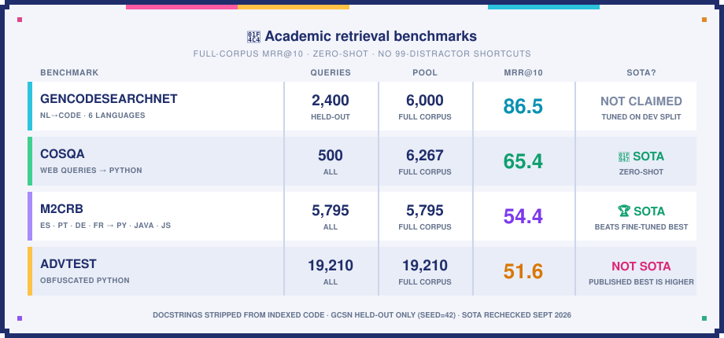
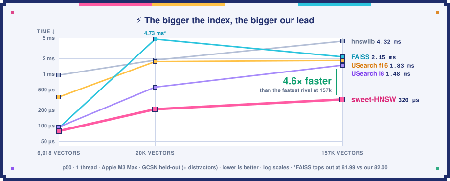
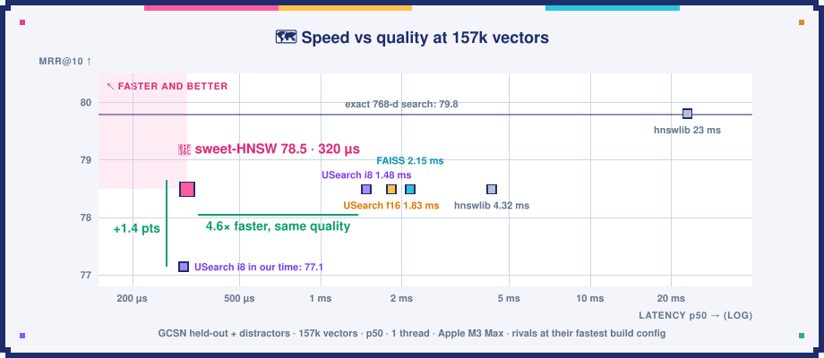
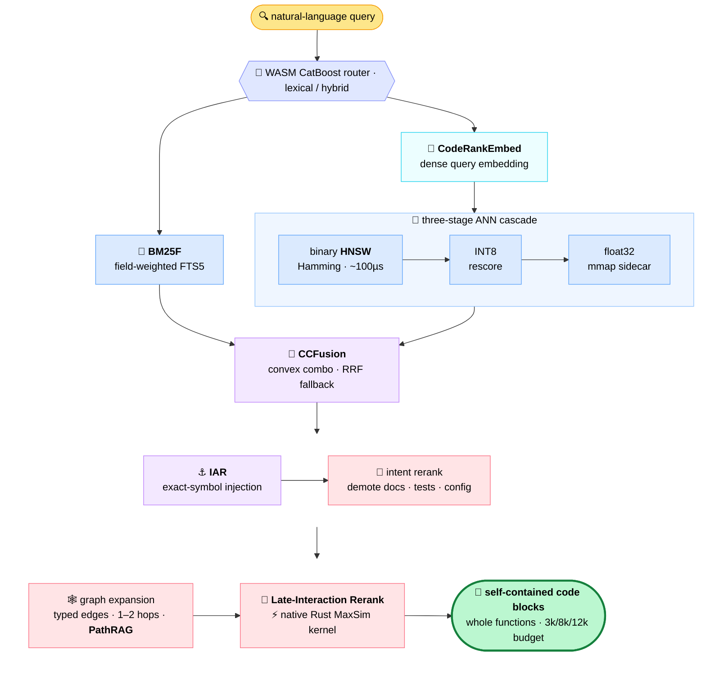
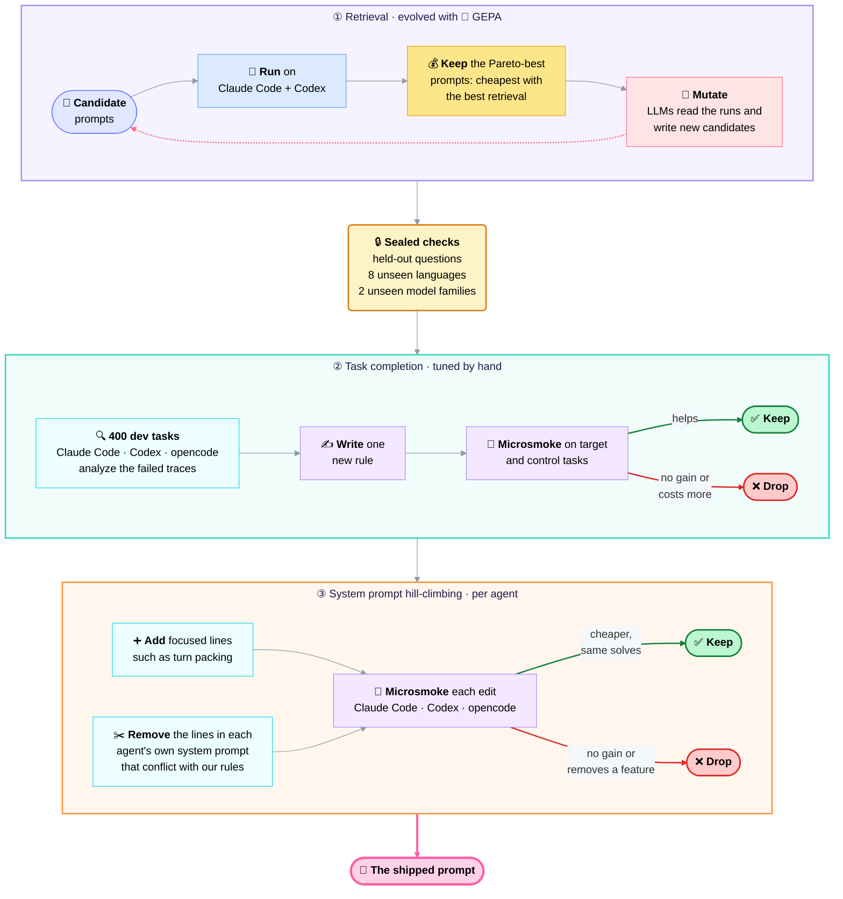
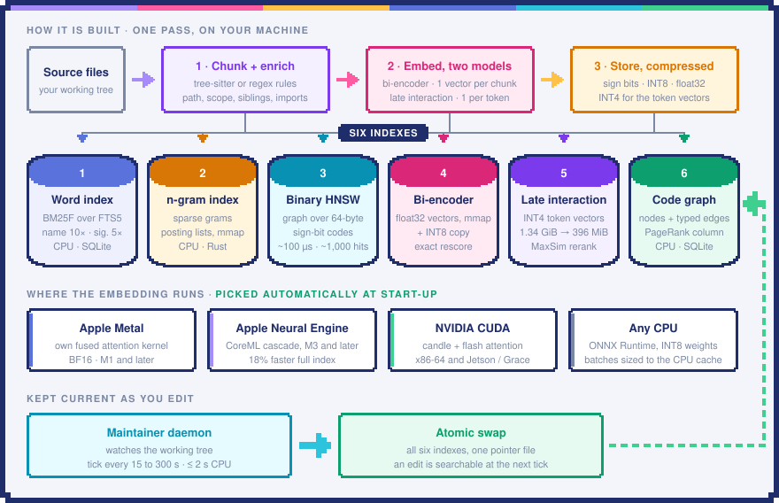

<div align="center">


## **🍬 Local code search for AI coding agents 🍬**<br>


Six fast, purpose-built tools made for *Claude Code*, *Codex* & friends 👀

Every coding agent today reaches for grep + Read by reflex. *sweet-search* challenges the narrative 😎

[](https://www.npmjs.com/package/sweet-search)
[](https://github.com/mrsladoje/sweet-search/stargazers)
[](LICENSE)
[](package.json)
[](#platform-support)
[](#the-index)

</div>

---

## ✨ Highlights

<table>
<tr>
<td width="50%" valign="top">

💰 **7–27% cheaper agent runs**<br>
<sub>on 200 real engineering tasks · up to 45% fewer tool calls · solve rate statistically tied</sub>

</td>
<td width="50%" valign="top">

⚡ **Saves your time**<br>
<sub>faster retrieval than classic grep-and-read · reduced walltime of agentic tasks</sub>

</td>
</tr>
<tr>
<td width="50%" valign="top">

🔄 **Index once, then forget it**<br>
<sub>one command, GPU-accelerated · updates itself as you edit, uncommitted changes included</sub>

</td>
<td width="50%" valign="top">

🔒 **100% local**<br>
<sub>no API keys · no cloud · no Docker · your code never leaves your machine</sub>

</td>
</tr>
</table>

---

## 📚 Table of Contents

<table>
<tr>
<td width="22%" valign="top">

**GET STARTED**

[🚀 Quickstart](#-quickstart)<br>
<sub>three commands to a searchable repo</sub>

[🖥️ Platform Support](#platform-support)<br>
<sub>macOS · Linux · WASM fallback</sub>

[⭐ A star pls? 🥺🙏](#found-it-useful)<br>
<sub>it really helps</sub>

</td>
<td width="27%" valign="top">

**THE ARCHITECTURE**

[🧰 The Six Tools](#-the-six-tools)<br>
<sub>search · grep · find · semantic · trace · read</sub>

[🧠 The System Prompt](#-the-system-prompt)<br>
<sub>tuned for search and task completion</sub>

</td>
<td width="27%" valign="top">

**INDEXING**

[🗂️ The Index](#the-index)<br>
<sub>candle · fused kernels · cAST chunking</sub>

[🔄 Incremental Indexing](#-incremental-indexing)<br>
<sub>reconcile daemon tracks your working tree</sub>

</td>
<td width="24%" valign="top">

**THE RECEIPTS**

[📊 Benchmarks](#-benchmarks)<br>
<sub>agent cost savings · engine speed · full-corpus MRR</sub>

[🧭 The Competition](#-the-competition)<br>
<sub>honest wins & trade-offs vs peers</sub>

[🙏 Prior Art & Acknowledgements](#-prior-art--acknowledgements)<br>
<sub>the shoulders we stand on</sub>

</td>
</tr>
</table>

## 🚀 Quickstart

- **Requires:** Node.js 22+
- **Runs on:** macOS (Apple silicon or Intel), Linux (x64 or ARM64), and Windows via WSL2

```bash
npm install -g sweet-search

cd your-repo
sweet-search init      # one-time: wires up Claude Code
                       # Codex: --codex · opencode: --opencode
                       # several: --claude --codex --opencode

sweet-search index     # builds the index — GPU-accelerated where available

sweet-search "where do we validate JWT tokens?"
```

That's it. From then on, the index updates itself as you work.

To uninstall 😢:

```bash
sweet-search uninstall          # this repo only
sweet-search uninstall --all    # everything: all repos, models, and the CLI
```

<details>
<summary><b>Setup options & details</b></summary>

<br/>

```bash
sweet-search init --wizard          # interactive: shows your hardware, recommends a model tier
sweet-search init --profile core    # lexical-only, no model downloads (CI-friendly)
sweet-search init --li-model edge   # compact late-interaction model for constrained machines
sweet-search init --codex           # Codex only (per-project config, nothing under .claude/)
sweet-search init --codex --opencode # Codex and opencode
sweet-search init --claude --codex  # Claude Code and Codex
sweet-search init --agents          # Claude Code plus AGENTS.md for other AGENTS.md-reading tools
sweet-search init --no-claude --agents # streamlined AGENTS-only configuration
sweet-search uninstall --dry-run    # preview cleanup for the current repo
```

- **Footprint** — models live in `~/.cache/sweet-search/models/` and run on-device only:
  - CPU-only: a few hundred MB (INT8)
  - GPU: +~1.2 GB (FP32), skipped where it wouldn't help
  - M3+ Mac: optional +~3.2 GB CoreML cascade for the Neural Engine
- **Which agents** — pick with flags:
  - `init` alone → Claude Code
  - `--codex` / `--opencode` → only those; add `--claude` to keep Claude Code too
  - `--agents` / `--gemini` / `--cursor` → also write `AGENTS.md` / `GEMINI.md` / a Cursor rule
  - Indexing, `.sweet-search/` and `--mcp` are the same for every choice.
- **Claude Code** — your `CLAUDE.md` stays untouched; everything goes in `.claude/`:
  - `agents/sweet-search.md`: the main agent, selected in `settings.json`. Claude Code's own prompt without its grep-first advice, plus our guide.
  - `agents/general-purpose.md`, `agents/Plan.md`: replace the built-in subagents; Explore is denied.
  - `rules/sweet-search.md`: a short reminder, gitignored (it names your local memory folder).
  - the `/sweet-index` skill.
  - Start a new session after init.
  - Already chose another main agent? init keeps it, puts the full guide in `rules/` plus the `sweet-search` output style, and warns.
- **Codex** — our guide and tested base instructions in `.codex/config.toml`:
  - Codex ignores `.codex/` until you trust the project; init tells you how.
- **opencode** — our guide, tested prompt and a tool-description plugin in `.opencode/`:
  - An existing `opencode.json` / `.jsonc` is edited in place, comments kept.
- **Prewarm hook** (Claude Code, Codex): only with a project-local install (`npm i -D sweet-search`). Search works without it.
- **What gets indexed:** `.gitignore` is respected; `node_modules`, build dirs, minified files and files over 1 MB are skipped; add extra rules in `.sweet-search-ignore`.

### MCP and other integrations

The CLI is the default contact surface. To also register the MCP server, run
`sweet-search init --mcp`, or add it to `.mcp.json` yourself:

```jsonc
{
  "mcpServers": {
    "sweet-search": {
      "command": "npx",
      "args": ["-y", "sweet-search-mcp", "--project-root", "/absolute/path/to/your/repo"]
    }
  }
}
```

- **MCP server:** 8 tools (`search`, `trace`, `read`, `read-semantic`, `index`, `health`, `repo-map`, `vocab-prewarm`), 2 resources, 2 prompts. All search tools are declared read-only and idempotent.
- **Repo maps for sub-agents:** the `repo-map` tool returns a PageRank-ranked symbol overview that fits any token budget, for briefing a delegated agent.
- **Vocabulary prewarm:** `sweet-search prewarm-vocab` mines your repo's real identifiers, detects code communities (Leiden), and pre-warms all three search modes, so the first semantic query of a session is already cache-warm.
- **Committed files stay portable:** init never writes machine-specific absolute paths into committed settings files. All instruction injection is marker-delimited and reversible.

### Init flags

| Flag | Behavior |
|---|---|
| `--profile core\|full` | Select lexical-only core or the full model-backed profile. |
| `--li-model standard\|edge\|none` | Select the late-interaction model tier or disable it. |
| `--search-reranking auto\|on\|off` | Control search-time late-interaction reranking. |
| `--wizard` | Choose model and reranking settings interactively. |
| `--verify-deep` | Load modules and verify checksums after setup. |
| `--force` | Re-download models even when cached. |
| `--build-coreml-cascade` | Build the optional CoreML cascade locally on eligible Apple silicon. |
| `--skip-coreml-cascade` | Skip fetching or building the CoreML cascade. |
| `--skip-dedup` | Skip near-duplicate-detection readiness checks. |
| `--skip-cuda` | Disable the CUDA backend even when available. |
| `--skip-prewarm-hook` | Do not register the Claude/Codex session-start prewarm hook. |
| `--agents` | Also write the verbatim guide to `AGENTS.md` (not needed for Codex or opencode). |
| `--codex` | Set up Codex only, in `.codex/`: guide, our base instructions, and the prewarm hook with its feature flag (project-local installs). |
| `--opencode` | Set up opencode only, in `.opencode/`: guide, our prompt, tool-description plugin, grep and explore off. |
| `--claude` | Include Claude Code together with `--codex` / `--opencode`. |
| `--codex-enable-global-hooks` | Advanced opt-in: also enable hooks in the user-level Codex config. |
| `--no-claude` | Write nothing under `.claude/`; combine with `--agents` for AGENTS-only setup (`--codex` / `--opencode` already imply it unless `--claude` is set). |
| `--gemini` | Also write `GEMINI.md` (sharing `AGENTS.md` when enabled). |
| `--cursor` | Also write `.cursor/rules/sweet-search.mdc`. |
| `--symlink-instruction-files` | Explicitly use the default `GEMINI.md` symlink behavior. |
| `--no-symlink-instruction-files` | Use a regular `GEMINI.md` import instead of a symlink. |
| `--no-agent-instructions` | Skip all agent policy and Claude output-style installation. |
| `--mcp` | Also register the project MCP server; the CLI remains the default contact surface. |
| `--no-cli` | With `--mcp`, give agents the MCP-specific guide and remove the CLI-specific Claude output style. |
| `--enforce-tools` | Optional strict Claude mode: deny native Grep and hint native Read. |
| `--verbose`, `-v` | Print additional setup diagnostics. |
| `--help`, `-h` | Show the complete CLI help. |

### Uninstall flags and cleanup

| Flag | Behavior |
|---|---|
| `--all` | Remove sweet-search from this machine: every repo where `init` ran, the shared model cache, and the npm package. |
| `--dry-run` | Preview all detected removals. |
| `--force` | Skip the confirmation prompt. |
| `--help`, `-h` | Show uninstall help. |

`sweet-search uninstall` removes Sweet Search's rule, main agent and subagent
files with their settings entries, output style, AGENTS/GEMINI/Cursor instruction blocks, project hooks and skill,
MCP registration, enforcement/reminder artifacts, and `.sweet-search/` from the
current repo. The shared model cache stays for your other repos. It
preserves user-authored content. Generic Codex `[features] hooks = true` flags
are left in place because other tools may share them, and an otherwise-empty
settings file may remain as `{}`.

</details>

## 📊 Benchmarks

We measure sweet-search four ways, from how much it helps a real agent, down to raw engine throughput:

<table>
<tr>
<td width="50%" valign="top">

🤖 **① [Code-retrieval](#bench-code-retrieval)**<br>
<sub>Does it make a coding agent **cheaper at equal accuracy** when it searches your repo?</sub>

</td>
<td width="50%" valign="top">

🛠️ **② [Task-completion](#bench-task-completion)**<br>
<sub>Does cheaper, denser context **compound** across multi-step engineering tasks? 200 *SWE-rebench* tasks.</sub>

</td>
</tr>
<tr>
<td width="50%" valign="top">

📄 **③ [Academic IR](#bench-paper-type)**<br>
<sub>The standard academic code-retrieval suites (GCSN, M2CRB, CoSQA…), full-corpus MRR@10.</sub>

</td>
<td width="50%" valign="top">

⚡ **④ [Engine speed](#bench-engine-speed)**<br>
<sub>Raw systems numbers: grep throughput, query latency, MaxSim rerank kernels, HNSW.</sub>

</td>
</tr>
</table>

---

<a id="bench-code-retrieval"></a>
### 🤖 1. Code-retrieval benchmark

> Sweet vs native compared in various code retrieval tasks, judged by *agents-in-the-loop*. 

<div align="center">


<br>
<br>

| 🔒 Split | 📝 Questions | 🧩 Question types | 📦 Repos | 🔁 Reps | ⚖️ Scoring |
|:---:|:---:|:---:|:---:|:---:|:---:|
| held-out | 200 · 103 easy + 97 hard | multi-hop · call chains · negatives | 11, in 11 languages | 3 per arm | 3-judge median |

</div>

<details>
<summary><b>📋 Full results & details</b></summary>

<br/>

Each value is sweet-search minus native, relative to native, pooled over 200 questions. Brackets hold the 95% interval. **Bold** = significant after Benjamini–Hochberg.

📏 **17 of 20 results survive multiple-comparison correction** (Benjamini–Hochberg, q = 0.05). The 3 that do not: both Opus accuracy deltas (equal) and Codex tool calls (+0.6%).

| 🧰 Harness + model | 🎯 Accuracy | 💰 Billed cost | 🧾 Cost without cache | 🔧 Tool calls | ⏱️ Wall time |
|---|---:|---:|---:|---:|---:|
| 🟣 **Claude Code** + Sonnet 5.5 high | **+2.4%** [+1.1, +3.7] | **−7.6%** [−9.9, −5.2] | **−16.6%** | **−14.1%** | −5.2% |
| 🟣 **Claude Code** + Opus 5.5 medium | +0.2% [−1.1, +1.6] | **−9.5%** [−11.4, −7.6] | **−7.1%** | **−22.8%** | −9.1% |
| 🟣 **Claude Code** + Opus 5.5 high | −0.5% [−1.9, +1.0] | **−9.5%** [−11.4, −7.6] | **−7.4%** | **−22.8%** | −6.9% |
| 🐚 **opencode** + Sol 6.1 high | **−2.8%** [−4.4, −1.2] | **−50.2%** [−54.4, −45.6] | **−25.4%** | **−33.1%** | −32.1% |
| 🤖 **Codex** + Sol 6.1 high | **−2.5%** [−4.0, −1.2] | **−7.7%** [−10.9, −4.3] | **+22.9%** | +0.6% | +17.7% |

<sub>Accuracy, sweet / native: Sonnet 0.899 / 0.879 · Opus medium 0.891 / 0.889 · Opus high 0.906 / 0.911 · opencode 0.869 / 0.893 · Codex 0.858 / 0.880. Wall time was not part of the pre-registered test family; its intervals are in the results file.</sub>

**Easy vs hard questions.** The savings hold on both tiers but shrink on hard questions. Opus 5.5 high: billed cost −11.0% (easy) and −8.5% (hard). Its accuracy delta is −0.1% (easy) and −1.1% (hard), neither significant. On Codex, the billed saving is −18.2% on easy questions and 0.0% on hard ones.

**Why the harnesses differ.** Claude Code's native loop is already disciplined, so the gain is fewer tool calls at equal accuracy. opencode's native loop thrashes (11.2 calls per question), so the cut is large. On Codex, sweet-search sends more input tokens, but a larger share of them hit the cache, because sweet-search keeps the stock Codex prompt unchanged as the cached prefix.

- **What's being compared:** the installed `sweet-search` prompt and tools vs. the *same model* with only its built-in file-reading and shell-grep tools. Both arms use the same harness version (Claude Code 2.1.281, codex-cli 0.159.2, opencode 1.18.4).
- **Questions:** the r3 benchmark, pre-registered before any scored run. 11 public repos that we never used in development: jj (Rust), dgraph (Go), tortoise-orm (Python), typedoc (TypeScript), zipkin (Java), Ocelot (C#), plus okhttp (Kotlin), sequel (Ruby), composer (PHP), drogon (C++) and GRDB (Swift) on the hard tier. Question types: multi-hop, cross-layer, call chains, completeness, enforcement, decoys, and **negatives** (the asked-for thing does not exist).
- **How the questions were built:** agents drafted them with plain tools, not sweet-search. Two non-Claude models verified each gold fact against the code, and Opus agents audited the result. Hard questions also passed a closed-book screen: we dropped any question that models could answer without the code.
- **Split:** stratified by repo and question type, seed 42. We tuned on the dev split only. The held-out split (103 easy + 97 hard) ran once, at the end, and we looked at aggregates only.
- **Scoring:** the median of a 3-judge panel (DeepSeek-V4-flash, Gemini-3.1-flash-lite, MiniMax), graded against the gold facts.
- **Cost:** *billed* = tokens × list price, with cache reads and writes priced as billed. *Without cache* = every input token at the full price. That shows how much of the saving comes from caching.
- **Statistics:** the unit is the question (mean over 3 reps). Paired, question-clustered bootstrap stratified by tier (B = 20,000, seed 42). Benjamini–Hochberg at q = 0.05 across the pre-registered 5 cells × 4 metrics.
- **Validity checks:** 6,000 rollouts, 0 failed. Cache-fairness checks passed for Claude Code and Codex. opencode shows a warning because sweet-search ships a cache-key plugin and stock opencode does not. That is a product difference, so "cost without cache" is the fair comparison there (−25.4%).
- **Honest caveats:** (1) On Sol 6.1, sweet-search costs about 2.5–3% accuracy. (2) The Codex saving exists only with the prompt cache. (3) The index was built from one commit (`65c4f20d`). Commits that landed during the run did not change the text or tools the agent sees.
- **Reproduction:** results, intervals and the correction script are in [`core/prompt-optimization/data/final-run/`](core/prompt-optimization/data/final-run/) (`HO1005-RESULTS.md`, `bh-heldout.mjs`, `questions-heldout.json`). The earlier sealed-vault study on older models is in [`docs/PHASE7.md`](docs/PHASE7.md).

**Why Sol 6.1 loses accuracy.** We diagnosed it on dev questions only, not on held-out ones. Sol 6.1 takes the sweet-search rules too literally. The rules say to stop searching once one file and symbol are confirmed. Sol obeys and stops, then writes a short answer that leaves out facts it already found. In about 13 of the 14 worst questions, the gold fact was in a tool output, but not in the answer. Sonnet 5.5 and Opus 5.5 read the same rules as guidance and still write complete answers. A rule change that targeted Sol did not hold up on fresh dev questions, so we did not ship it.

</details>

---

<a id="bench-task-completion"></a>
### 🛠️ 2. Task-completion benchmarks — *does it compound?*

Retrieval quality is necessary but not sufficient. Cheaper, denser context only matters if it
**compounds across a real, multi-step engineering task** — find the code, understand it, change it,
don't break anything. This suite measures exactly that: **resolve-rate and cost on SWE-rebench-style
multi-file tasks**, sweet-search-wired vs. the same model's native loop.

One variable changes, again: **how the agent searches.** Same model, same tasks, same grader, paired
per task. The harnesses run **as they ship** — no tools disabled, no delegation switched on or off.

<div align="center">


<sub>frozen held-out set · 200 tasks · 1 rep per arm · grey = not significant or no interval yet · more arms running</sub>

</div>

<details>
<summary><b>📋 Full per-harness results & how it's measured</b></summary>

<br/>

| 🧰 Harness | 💰 Cost, same tasks solved | 💰 Cost, all tasks | 🎯 Resolved | 🪆 Subagent requests | 🔧 Tool calls |
|---|---:|---:|:--|---:|---:|
| 🟣 **Claude Code** | **−31.0%** ᵃ | −27.4% | 66 / 69 · *p=0.66* | **150 / 1,191** | 19.6 / 35.8 |
| 🐚 **opencode** | **−7.7%** | −11.5% | 65 / 71 · *p=0.18* | not instrumented | 19.0 / 24.4 |
| 🤖 **Codex** | **−2.1%** ᵇ | −6.8% | 72 / 79 · *p=0.12* | none (no subagent tier) | 10.6 / 8.8 |

<sub>All figures sweet-search / native. ᵃ Claude Code is the only leg priced from a **real OpenRouter
invoice** (10,371 generation records, 0 unresolved), sidechain-**inclusive**, because its `rows.json`
nulls cost arm-asymmetrically and would reverse the sign. ᵇ Codex ran on a ChatGPT subscription, so
**nothing was billed** — its dollars are list-price-equivalent, not an invoice. opencode is
list-price ledger with 0 nulls on both arms.</sub>

**The mechanism, stated plainly.** Sweet-search's main-loop spend is close to native's (−6.1% on
Claude Code). The gap is delegation: native spawns subagents to explore a repo it can't navigate
cheaply, and each one is a fresh context that gets billed. Better retrieval removes the reason to
delegate. That's why the same product shows 31% on a harness with a subagent tier and 2% on one
without — and why we quote a **range, not one number**.

- **What's compared:** the installed `sweet-search` agent prompt + tools vs. the *same model* using
  its built-in file-reading and shell-grep loop. The sweet-search system prompt says nothing about
  subagents or delegation — it only routes code search through `ss-*`.
- **Design:** 200 tasks × 2 arms × 1 rep × 3 harnesses = **1,200 rollouts**. Tasks drawn from
  SWE-rebench V1+V2, admitted only if the official gold patch grades FULL in the exact run
  environment (a "green ledger" gate), and re-verified per run.
- **Isolation:** every rollout runs in its own mount/PID/network jail with an SNI-allowlist egress
  proxy — the agent can reach the model API and nothing else. No GitHub, no package registries.
  Escape attempts are counted, not assumed to be zero.
- **Grading:** the official SWE-bench/SWE-rebench Docker evaluator, `FAIL_TO_PASS` +
  `PASS_TO_PASS`. A patch that produces no test evidence is marked **ungradeable**, never scored
  zero. Final run: **0 ungradeable, 0 zero-call rollouts, 0 run errors** across all 1,200.
- **Honest caveats we keep attached:** (1) **1 rep** — a single cell on this bench has been observed
  swinging 3/3 → 1/3 → 2/3 across identical runs, so the solve column is a point estimate.
  (2) **37 of 199 stamped tasks (18.6%) are naming lotteries** — the hidden test needs an identifier
  the reference patch invented, which no amount of retrieval can recover. (3) Three legs, three cost
  bases, only one a real invoice — **do not pool the dollar figures**. (4) The three solve deltas all
  lean the same way (−3, −6, −7); individually noise, collectively a hint that sweet-search may cost
  a little accuracy, and we'd rather say so than round it to zero.

</details>

---

<a id="bench-paper-type"></a>
### 📄 3. Academic retrieval benchmarks

One question: ***how well does `ss-search` rank code on the standard academic suites?***

- 📂 **Full corpus:** each query ranks against the whole benchmark, not 99 sampled distractors.
- 🧊 **Zero-shot:** no fine-tuning on any of these tasks.
- ✂️ **Docstrings stripped:** where queries come from docstrings, the indexed code loses them.

<div align="center">



<sub>MRR@10 · SOTA = best published result we can find, rechecked October 2026 · GCSN held-out only: we tuned ranking on its dev split</sub>

</div>

<details>
<summary><b>Per-benchmark notes & methodology</b></summary>

<br>  
  
| Benchmark | Score | Notes |
|---|---|---|
| 🌐 **GenCodeSearchNet** | `86.5` held-out<br>🔧 our tuning benchmark | • We tuned ranking on a dev split (600 queries per language, stratified, seed=42). The table shows only the other 2,400 held-out queries, inspected aggregate-only. Dev scores 87.0; both splits together score 86.8.<br>• The paper's baselines (≤ 0.42 fine-tuned, 0.79–0.94 zero-shot Ada-2) rank against 99 distractors. Ours ranks against all 6,000 documents, so the numbers aren't directly comparable. |
| 🐍 **CoSQA** | `65.4`<br>🥇 zero-shot SOTA | • 500 real web queries against the fixed 6,267-code database.<br>• Beats every published zero-shot model: CodeSage-Large `47.5` · OpenAI text-embedding-3-large `55.4` · OASIS `55.8`. Between *fine-tuned* CodeBERT and GraphCodeBERT (`64.7` / `67.5`).<br>• CoSQA has known label noise, so read the absolute height with a pinch of salt. |
| 🗺️ **M2CRB** | `54.4`<br>🏆 SOTA | • 🇪🇸 Spanish · 🇵🇹 Portuguese · 🇩🇪 German · 🇫🇷 French queries → Python / Java / JavaScript.<br>• The paper's best is a fine-tuned CodeBERT at **52.7 auMRRc**. That metric averages over easier, smaller pools, so `auMRRc ≥ full-pool MRR` for any model. Our 54.4 is full-pool MRR@10 over all 5,795 functions, zero-shot. |
| 🛡️ **AdvTest** | `51.6` | • Beats the classic fine-tuned baselines (CodeBERT `27` · GraphCodeBERT `35` · UniXcoder `41`).<br>• Our pipeline adds about 3 points over our bare encoder (`48.5`), even on obfuscated code.<br>• The often-cited `59.5` for bare CodeRankEmbed is MRR@1000 on less strictly prepared data. Ours is MRR@10 on a leak-free corpus. |

#### 📐 Methodology
- **Reproduction:** the result file for each headline number is in [`eval/results/`](eval/results/). Rerun one with `node eval/run_benchmark.js --dataset=<name> --profile=full` (add `--split=heldout` for GenCodeSearchNet). The canonical full-pool loaders are in `eval/download_data.py`.
- **Docstring stripping.** For docstring-derived benchmarks (AdvTest, M2CRB) we strip the docstring from the indexed code. Otherwise the query matches itself verbatim: a no-strip AdvTest run scores a meaningless 0.98.
- **Dev/held-out split.** Ranking work iterates on a fixed, stratified dev split (seed=42); the rest is held-out and inspected aggregate-only at milestones. We did not tune ranking on CoSQA, M2CRB or AdvTest.
- **What we don't claim yet.** CoIR (NDCG@10 over per-subtask corpora up to ~1M docs), CoSQA+ (multi-positive, MAP-primary) and CLARC (per-group pools) use protocols our single-pool MRR@10 harness doesn't match, so we omit them.
- **Honesty corner:** CrossCodeEval (cross-file *completion-context* retrieval, a different task than NL search) sits at 0.18. We don't optimize for it and report it anyway.

</details>

---

<a id="bench-engine-speed"></a>
### ⚡ 4. Engine speed and quality

<table width="100%">
<tr>
<td width="50%" valign="top" align="center">

<h3>⚡<code>ss-grep</code>⚡</h3> 

### 2.06× faster

<sub>end to end, median, held-out queries</sub>

| | median | |
|:--|--:|:--|
| `ss-grep` | **3.59 ms** | `████` |
| ripgrep 15.1 | 7.29 ms | `████████` |

<sub>1,600 queries shaped like 19,762 agent greps</sub><br>
<sub>13 repos · same hit counts · dev split 2.01×</sub><br>
<sub>M3 Max · [method](docs/GREP_INDEXING_STRATEGY.md)</sub>

</td>
<td width="50%" valign="top" align="center">

<h3>🧮 <b>Sweet MaxSim kernel</b></h3>

### 1.6–3.9× faster

<sub>4k+ replayed production calls, same ranking</sub>

| | p50, ms | sweet faster |
|:--|--:|:--|
| **sweet** | **0.137** | `██` |
| NumPy | 0.272 | `████` **1.6–1.9×** |
| maxsim-cpu | 0.540 | `████████` **2.9–3.9×** |

<sub>maxsim-cpu in its best case (f32, pre-normalized)</sub><br>
<sub>M3 Max · [method](eval/maxsim-bench/README.md)</sub>

</td>
</tr>
<tr>
<td colspan="2" valign="top" align="center">

<h3>🧠 <b>Native HNSW vector search</b></h3>


<details>
<summary><b>📈 The lead grows with index size · speed vs quality at 157k</b></summary>
<br/>


</details>

<sub>full vector pipeline vs FAISS, USearch, hnswlib · rivals at their defaults and at our budget (M64, efC800), efSearch to 2048 · binary walk alone 5–8× faster than FAISS / USearch binary HNSW · 157k RAM: 197 MB vs 242 MB USearch i8, 541 MB FAISS · 2,400 GCSN held-out queries (seed 42) + dev-repo distractors · M3 Max · [full results](docs/HNSW_BENCHMARK.md)</sub>

</td>
</tr>
</table>

⏱️ **Warm query latency:** **2.9 ms** warm · 108 ms cold, native CLI ([source](docs/INIT_STRATEGY.md))<br>
🧠 **HNSW tuned for code:** **−33%** search p50, **+5.9 pp** recall@200, against our earlier HNSW ([source](docs/HNSW_APPROACH.md))

<details>
<summary><b>🔧 Internal optimisations (against our own earlier versions)</b></summary>

<br/>

| ⚙️ What | 📈 Result | 📄 Source |
|------|--------|--------|
| 🧮 MaxSim kernel vs plain code | **1.26 s → 27 ms** for a 231-candidate pass (47× native Rust; 16× WASM SIMD) | [`docs/MAXSIM_OPTIMIZATION.md`](docs/MAXSIM_OPTIMIZATION.md) |
| 💾 Indexing memory | peak JS heap **785 MB → 213 MB** | [`docs/DISK_FLUSHING_STRATEGY.md`](docs/DISK_FLUSHING_STRATEGY.md) |
| 🍏 CoreML cascade (M3 Max) | **18% faster** full indexing vs the Metal baseline | [`docs/INIT_STRATEGY.md`](docs/INIT_STRATEGY.md) |

</details>

---

## 🧰 The Six Tools

Six tools that share one index. Your agent picks the one that fits the question.

<table>
<tr>
<td align="center" valign="top" width="33%">
<a href="#tool-ss-search"></a><br/>
<b>1. <a href="#tool-ss-search"><code>ss-search</code></a></b><br/>
search by meaning
</td>
<td align="center" valign="top" width="33%">
<a href="#tool-ss-grep"></a><br/>
<b>2. <a href="#tool-ss-grep"><code>ss-grep</code></a></b><br/>
exact text, fast
</td>
<td align="center" valign="top" width="33%">
<a href="#tool-ss-find"></a><br/>
<b>3. <a href="#tool-ss-find"><code>ss-find</code></a></b><br/>
a pattern, ranked by meaning
</td>
</tr>
<tr>
<td align="center" valign="top" width="33%">
<a href="#tool-ss-semantic"></a><br/>
<b>4. <a href="#tool-ss-semantic"><code>ss-semantic</code></a></b><br/>
search inside one file
</td>
<td align="center" valign="top" width="33%">
<a href="#tool-ss-trace"></a><br/>
<b>5. <a href="#tool-ss-trace"><code>ss-trace</code></a></b><br/>
who calls what
</td>
<td align="center" valign="top" width="33%">
<a href="#tool-ss-read"></a><br/>
<b>6. <a href="#tool-ss-read"><code>ss-read</code></a></b><br/>
read files from disk
</td>
</tr>
</table>

---

<a id="tool-ss-search"></a>
###  1. `ss-search`: hybrid code search


A hybrid search pipeline with late interaction reranking that returns actual code blocks.

SOTA on [2 of 4 academic code-search benchmarks](#bench-paper-type).


```mermaid
flowchart TD
    Q(["🔍  natural-language query"]) --> ROUTE{{"🧭 WASM CatBoost router · lexical / hybrid"}}

    ROUTE --> BM["📑 <b>BM25F</b><br/>field-weighted FTS5"]
    ROUTE --> EMB["🔢 <b>CodeRankEmbed</b><br/>dense query embedding"] --> ANN

    subgraph ANN ["🧬 three-stage ANN cascade"]
        direction LR
        BIN["binary <b>HNSW</b><br/>Hamming · ~100µs"] --> INT["INT8<br/>rescore"] --> FL["float32<br/>mmap sidecar"]
    end

    BM  --> FUSE
    ANN --> FUSE
    FUSE["🔀 <b>CCFusion</b><br/>convex combo · RRF fallback"] --> ROW1

    subgraph ROW1 [" "]
        direction LR
        IAR["⚓ <b>IAR</b><br/>exact-symbol injection"] --> INTENT["🎯 intent rerank<br/>demote docs · tests · config"]
    end

    ROW1 --> ROW2

    subgraph ROW2 [" "]
        direction LR
        GRAPH["🕸️ graph expansion<br/>typed edges · 1–2 hops · <b>PathRAG</b>"] --> MAXSIM["🧮 <b>Late-Interaction Rerank</b><br/>⚡ native Rust MaxSim kernel"] --> OUT(["🏁 <b>self-contained code blocks</b><br/>whole functions · 3k/8k/12k budget"])
    end

    classDef io    fill:#fde68a,stroke:#f59e0b,color:#000;
    classDef out   fill:#bbf7d0,stroke:#15803d,color:#000,stroke-width:3px;
    classDef route fill:#e0e7ff,stroke:#818cf8,color:#000;
    classDef lex   fill:#dbeafe,stroke:#60a5fa,color:#000;
    classDef fuse  fill:#f3e8ff,stroke:#c084fc,color:#000;
    classDef rank  fill:#ffe4e6,stroke:#fb7185,color:#000;
    classDef emb   fill:#ecfeff,stroke:#22d3ee,color:#000;

    class Q io;
    class OUT out;
    class ROUTE route;
    class EMB emb;
    class BM,BIN,INT,FL lex;
    class FUSE,IAR fuse;
    class INTENT,GRAPH,MAXSIM rank;

    style ANN  fill:#eff6ff,stroke:#93c5fd,color:#000;
    style ROW1 fill:none,stroke:none;
    style ROW2 fill:none,stroke:none;
```

<sub>↑ The diagram shows the **hybrid** route. A pure keyword query or a literal file path goes from the router straight to BM25F and skips the vector search and fusion.</sub>

<details>
<summary><b>🗺️ Diagram explained</b></summary>

<br/>

| Stage | What it actually does |
|-------|-----------------------|
| 🧭 **Route** | **WASM-exported CatBoost** · lexical / hybrid · **~10 µs** routing · low-confidence → max-recall hybrid |
| 🧬 **Retrieve** | • **Lexical:** **BM25F** over field-weighted FTS5 (name 10× · signature 5× · alias 4× · doc 1×)<br/>• **Embed:** query vectorized by the local **CodeRankEmbed** model (swappable for Voyage / Jina / Codestral)<br/>• **Vector cascade:** binary **HNSW** (Hamming, 64-byte, ~100 µs) → INT8 rescore → exact float32 from a memory-mapped sidecar |
| 🔀 **Fuse** | • **CCFusion:** convex-combine both rankings · per-route weights · quantile-normalized<br/>• **MMR** (λ=0.9) diversity pass over the fused list<br/>• auto **RRF** (k=60) fallback on degenerate score distributions |
| ⚓ **Anchor** | • **IAR** (Identifier Anchor Retrieval): a real symbol in the query fires an exact-name code-graph lookup that injects that entity, even when the encoder ranked it too low |
| 🎯 **Intent Rerank** | • demote docs / tests / config when you want implementation<br/>• log-scaled call-site boosts surface the most-referenced function |
| 🕸️ **Graph Expansion** | • typed-edge walks (`imports`/`extends`/`calls`/`uses`) · adaptive 2-hop on the AST graph · edges picked by intent<br/>• **PathRAG** flow pruning + degree normalization → hubs can't dominate |
| 🧮 **Late interaction Rerank** | • Query embedded per-token by **LateOn-Code** (149M; a 17M **edge** variant auto-selected on low-RAM hosts)<br/>• **MaxSim** against the pre-indexed quantized token vectors<br/>• native Rust+Rayon MaxSim kernel ⚡ · WASM-SIMD fallback (1.26 s → 27 ms on a 231-candidate rerank) |
| 📦 **Package** | • entity-aware expansion → whole functions (imports, docstrings, decorators)<br/>• same-file overlap demotion → diverse, non-overlapping spans<br/>• **symbol-family completion** (agent mode): generated/width families surface as a compact indexed manifest instead of truncating silently, inside the same budget<br/>• auto-selected **3k / 8k / 12k** token budget |

</details>

<details>
<summary><b>🌶️ Extra spice: what the diagram leaves out</b></summary>

<br/>

- 🧠 **A denser vector graph than most.** Our own binary HNSW raised recall@200 from 80.6% to 86.5% and got about a third faster.
- ⚡ **Native reranking.** The MaxSim math runs in Rust on all CPU cores, 47× faster than plain code.
- 📦 **A small index.** Token vectors are packed into 4 bits, which makes that index 3.4× smaller.
- 🎛️ **Quality scores.** Each chunk is scored on test proximity, git recency, call-graph centrality, comments and complexity. Production code rises and old fixtures sink.
- 🛟 **A reranker we switched off.** We built a cross-encoder too. It was 3× slower and did not beat MaxSim, so it ships disabled.

Also available as `sweet-search "<query>"` on the CLI and the `search` MCP tool. Use `--full` or `--xl` for a bigger answer, and `--mode lexical|semantic|hybrid|pattern` to pick a mode. Full details: [vector index](docs/HNSW_APPROACH.md) · [quantization](docs/LI_QUANTIZATION_STRATEGY.md).

</details>

---

<a id="tool-ss-grep"></a>
###  2. `ss-grep`: grep, minus every wasted millisecond and token


### ⚡ 2× faster than ripgrep, end to end
> Median over 1,600 queries on 13 repos of 130 to 63k files. Query shape distribution is modelled on 20k real agent greps.

<table><tr><td>

**What makes it fast**

- 🧩 **Sparse n-gram index.** Grams are sized to your repo's own text, so each one points to few files. The idea comes from [Cursor's fast regex search](https://cursor.com/blog/fast-regex-search) and [GitHub's Blackbird](https://github.blog/engineering/architecture-optimization/the-technology-behind-githubs-new-code-search/).
- 🎯 **Literal filter.** The fixed text is pulled out of the regex, and SIMD intersects the file lists. Only 0.1–5% of files see the real regex.
- 🦀 **All in-process.** Rust regex runs on all cores inside the warm daemon. No subprocess, no pipes, no JSON parsing.

</td></tr>
<tr><td>

**What makes it rank better**

- 🗳️ **Best files and lines first.** Files are ranked by hit count and type: source before tests, generated files last. Output lines are shared out like parliament seats ([Sainte-Laguë](https://en.wikipedia.org/wiki/Webster/Sainte-Lagu%C3%AB_method)), one per file first, and the lines that declare a function or class come first.
- 🔁 **Proven on real agent runs.** We replayed 1000+ real agent grep calls with known answers. When the hits overflow, the line that declares the answer now shows up in 64% of calls, up from 34%.

</td></tr></table>


<details>
<summary><b>More</b></summary>

<br/>

- Each file's path prints once, with no header or legend. That cut our output by a third, with no hit or count lost.
- Method, per-repo results and the optimization log: [`docs/GREP_INDEXING_STRATEGY.md`](docs/GREP_INDEXING_STRATEGY.md).
- A regex with no fixed text (for example `\w+\d`) cannot use the index, so it scans every indexed file.

</details>

---

<a id="tool-ss-find"></a>
###  3. `ss-find`: grep that knows what you meant


### 🎯 Exact matches, semantically reranked
> The idea comes from LightOn's [ColGrep](https://github.com/lightonai/next-plaid/tree/main/colgrep). We rebuilt it on the `ss-grep` index, with our own MaxSim kernel.

<table>
<tr><td colspan="2"><b>What makes it fast</b></td></tr>
<tr>
<td width="50%" valign="top">

**⚡ Built on `ss-grep`**

- The regex runs on the sparse n-gram index.
- That index makes `ss-grep` 2× faster than ripgrep, end to end.
- Your query is turned into embeddings at the same time.

</td>
<td width="50%" valign="top">

**🦀 Our own MaxSim kernel**

- Rust + SIMD, on all cores.
- Code embeddings are stored at index time, so no model reads your code at query time.
- 231 matches: 1.26 s in plain JS → 27 ms.
- July rewrite: another 4–6× faster.

</td>
</tr>
</table>

<details>
<summary><b>More</b></summary>

<br/>

- **Ranking:** on 60 pattern queries, MRR@10 is 0.45. Grep order gets 0.11, and search without the regex gets 0.30.
- **Agent eval (April 2026):** Claude Sonnet 4.6 answered 30 fastify questions. Versus grep + read, follow-up reads fell from 4.9 to 0 and tokens fell 25.4%, at equal quality (blind Claude Opus 4.6 judge). The prompt was tuned on these same 30 questions.
- Needs the late-interaction index, which is built by default.
- Also available as `sweet-search --mode pattern` and as the `regex` argument of the MCP `search` tool.
- Kernel details: [`docs/MAXSIM_OPTIMIZATION.md`](docs/MAXSIM_OPTIMIZATION.md).

</details>

---

<a id="tool-ss-semantic"></a>
###  4. `ss-semantic`: hybrid search inside one file


### 📍 Ask one file a question
> You already know the file. `ss-semantic` gives you the code spans that best match your query, each with its line range. The rest of the file stays out of your context.

<table>
<tr><td colspan="2"><b>How it picks the lines</b></td></tr>
<tr>
<td width="50%" valign="top">

**🧮 Words and meaning, one ranking**

- ***Words:*** BM25-style match on your terms, plus exact symbol names at 1.5× weight.
- ***Meaning:*** MaxSim over LateOn-Code token embeddings.
- ***Reciprocal Rank Fusion*** merges the lists.

</td>
<td width="50%" valign="top">

**📄 Always the live file**

- The best spans are read again from disk.
- Each span gets 2 lines of context on each side. Overlapping spans are merged.
- So you see the current code, even during an edit.

</td>
</tr>
</table>

<details>
<summary><b>More</b></summary>

<br/>

- Returns the top 5 spans by default. Change it with `--top`.
- A file that is not indexed falls back to a plain read.
- Also available as `sweet-search read-semantic` and as the `read-semantic` MCP tool.

</details>

---

<a id="tool-ss-trace"></a>
###  5. `ss-trace`: callers, callees and impact from the code graph


### 🕸️ Know what breaks before you edit
> Give `ss-trace` a symbol. It returns who calls it, what it calls, and what breaks if it changes. The graph updates as you edit, so the answer matches your current code.

<table>
<tr><td colspan="2"><b>How it builds the answer</b></td></tr>
<tr>
<td width="50%" valign="top">

**🏗️ The codegraph**

- Every function, class and method, and the links between them (imports, extends, calls, ...).
- Each symbol gets an importance score (PageRank). Code that many places depend on scores higher.

</td>
<td width="50%" valign="top">

**🧭 Best results first**

- Personalized PageRank walks out from your symbol: backward for callers, forward for callees. Code close to your symbol ranks high. A logger that everything calls ranks low.

</td>
</tr>
</table>

<details>
<summary><b>More</b></summary>

<br/>

- Add `callers`, `callees` or `impact` after the symbol to get only that part.
- Two symbols with the same name? Pick one with `--in <file>`.
- Impact paths go 3 hops deep by default. Change it with `--depth` (1 to 4).
- `sweet-search trace` and the MCP tool also return the code, in a 4k, 8k or 12k token budget.
- On very dynamic code (calls by string name, metaprogramming), the graph can miss calls.
- Also available as `sweet-search trace` and as the `trace` MCP tool.

</details>

---

<a id="tool-ss-read"></a>
###  6. `ss-read`: read files from disk


### 📖 Read the code, see what you skipped
> Give `ss-read` a file and a line range. It reads from disk, so the code is always current, and it names what the agent has not read yet.

<details>
<summary><b>More</b></summary>

<br/>

- After the code, it names what the agent has not read yet:
  - the functions that come after the range, with their line ranges;
  - the fields and constants above the range that the code uses.
- Lines the agent already read, if unchanged, come back as a one-line reminder instead of the code.
- `10-20`, `10:20` and `40 5` (5 lines from line 40) also work as ranges.
- Minified and generated files are refused.
- Set the line-number format with `SS_READ_GUTTER=tab|colon|none`.
- Also available as `sweet-search read`.

</details>

---

## 🧠 The System Prompt

<table>
<tr>
<td align="center" valign="top" width="33%">
<h3>🧰<br/>Six tools</h3>
give the agent its power, but to <i>no avail</i> if it doesn't use them efficiently.
<br/><br/>
</td>
<td align="center" valign="top" width="33%">
<h3>🧠<br/>One prompt</h3>
tells the agent how to <i>optimally</i> use them.
<br/><br/>
</td>
<td align="center" valign="top" width="33%">
<h3>📈<br/>Hill-climbed</h3>
We <b>hill-climbed</b> that prompt for the <i>largest cost saving at unharmed retrieval quality</i>.
<br/><br/>
</td>
</tr>
</table>

`sweet-search init` installs the prompt for you. Here is how we found it, with [🧬 GEPA](https://arxiv.org/abs/2507.19457) for step ① 👇


```mermaid
%%{init: {"theme": "base", "themeVariables": {"titleColor": "#1e1b4b", "textColor": "#1e1b4b", "lineColor": "#8e9baa", "edgeLabelBackground": "#f4f8fb"}, "themeCSS": ".cluster-label span { font-size: 19px; font-weight: 700; }", "flowchart": {"wrappingWidth": 400, "rankSpacing": 65, "nodeSpacing": 60, "subGraphTitleMargin": {"top": 6, "bottom": 14}}}}%%
flowchart TB
    subgraph S1["① Retrieval · evolved with 🧬 GEPA"]
        direction LR
        A(["📝 <b>Candidate</b><br/>prompts"]) --> B["🤖 <b>Run</b> on<br/>Claude Code + Codex"]
        B --> C["💰 <b>Keep</b> the Pareto-best<br/>prompts: cheapest with<br/>the best retrieval"]
        C --> D["🔁 <b>Mutate</b><br/>LLMs read the runs and<br/>write new candidates"]
        D -.-> A
    end
    S1 --> V("🔒 <b>Sealed checks</b><br/>held-out questions<br/>8 unseen languages<br/>2 unseen model families")
    V --> S2
    subgraph S2["② Task completion · tuned by hand"]
        direction LR
        E["🔍 <b>400 dev tasks</b><br/>Claude Code · Codex · opencode<br/>analyze the failed traces"] --> F["✍️ <b>Write</b> one<br/>new rule"]
        F --> G["🧪 <b>Microsmoke</b> on target<br/>and control tasks"]
        G -->|"helps"| H(["✅ <b>Keep</b>"])
        G -->|"no gain or<br/>costs more"| I(["❌ <b>Drop</b>"])
    end
    S2 --> S3
    subgraph S3["③ System prompt hill-climbing · per agent"]
        direction LR
        J["✂️ <b>Remove</b> the lines in each<br/>agent's own system prompt<br/>that conflict with our rules"]
        L["➕ <b>Add</b> focused lines<br/>such as turn packing"]
        K["🧪 <b>Microsmoke</b> each edit<br/>Claude Code · Codex · opencode"]
        L --> K
        J --> K
        K -->|"cheaper,<br/>same solves"| M(["✅ <b>Keep</b>"])
        K -->|"no gain or<br/>removes a feature"| N(["❌ <b>Drop</b>"])
    end
    S3 ==> P(["🍬 <b>The shipped prompt</b>"])

    classDef cand  fill:#e0e7ff,stroke:#596fff,color:#000;
    classDef run   fill:#dbeafe,stroke:#60a5fa,color:#000;
    classDef score fill:#fde68a,stroke:#f59e0b,color:#000;
    classDef llm   fill:#ffe4e6,stroke:#fb7185,color:#000;
    classDef seal  fill:#fef3c7,stroke:#d97706,color:#000,stroke-width:2px;
    classDef dig   fill:#ecfeff,stroke:#22d3ee,color:#000;
    classDef rule  fill:#f3e8ff,stroke:#a78bfa,color:#000;
    classDef keep  fill:#bbf7d0,stroke:#15803d,color:#000,stroke-width:2px;
    classDef drop  fill:#fecaca,stroke:#dc2626,color:#000,stroke-width:2px;
    classDef ship  fill:#ffd1e6,stroke:#ff5ba3,color:#000,stroke-width:3px;

    class A cand;
    class B run;
    class C score;
    class D llm;
    class V seal;
    class E dig;
    class F,G rule;
    class H,M keep;
    class I,N drop;
    class J,L dig;
    class K rule;
    class P ship;

    style S1 fill:#f5f3ff,stroke:#a78bfa,stroke-width:2px;
    style S2 fill:#f0fdfa,stroke:#2dd4bf,stroke-width:2px;
    style S3 fill:#fff7ed,stroke:#fb923c,stroke-width:2px;

    linkStyle 3 stroke:#fb7185,stroke-width:2px;
    linkStyle 8 stroke:#15803d,stroke-width:2px;
    linkStyle 9 stroke:#dc2626,stroke-width:2px;
    linkStyle 13 stroke:#15803d,stroke-width:2px;
    linkStyle 14 stroke:#dc2626,stroke-width:2px;
    linkStyle 15 stroke:#ff5ba3,stroke-width:3px;
```

### 💡 What the prompt says

> Open with the cheapest tool. Trust the ranking. Treat two empty searches as proof of absence. Stop searching once you have the answer.

<details>
<summary><b>📄 Read the full prompt</b></summary>

<br/>

```markdown
# Sweet-search — code search tool guide

These are code-search rules only — they never decide when the task is done; the deliverable is whatever the task/prompt asks for. When the task calls for a change, locating the right code is a means, not the finish line: apply the edit with your normal file-editing tool and never a description of the fix in place of the fix.

Sweet-search indexes the working tree (uncommitted edits too) and searches it faster and cheaper than raw shell. Use the `ss-*` tools for all code search and navigation. Reach for raw `grep`/`cat` or the native reader only for an edit too recent to be reconciled (seconds old) — otherwise the index covers every file, so a raw scan only re-confirms an `ss-*` result at higher cost, never beats it. Never re-run an `ss-*` hit as raw grep. Any sub-agent you delegate to must use these `ss-*` tools, with this system prompt verbatim.

## Tools (search commands, invoked via Bash)
- `ss-search "<query>" [-k N]` — semantic, ranked code blocks; default when you have no exact symbol
- `ss-find "<query>" --regex "<regex>" [-k N]` — `ss-grep`'s regex matches, semantically re-ranked by the query
- `ss-grep "<regex>" [-k N]` — exact literals; prints the path of each file once, then its hits as `line:<full line>`
- `ss-grep` flags when needed: `-g '!<glob>'` excludes paths (tests, vendored, generated), `-g '<glob>'` / `--in <path>` scopes, `-i`, `-w`, `-A/-B/-C N`. Start broad; scope only after a broad grep shows where.
- `ss-semantic <file> "<query>"` — top ranked spans in one known file
- `ss-trace <symbol> [callers|callees|impact] [--in <file>]` — a symbol's callers, callees and impact
- `ss-read <file> [start] [end]` — a narrow range

## Open with the cheapest tool for what you hold
- **An exact token** (identifier, function/class/constant, error string, config key, path you could copy-paste): ONE `ss-grep` on that literal (rarest token, escaped) or `ss-find` `\b<symbol>\b`. Trust the top hit and stop — no `ss-search` first, no confirming re-search. One exception: if the top hit is an autogenerated file (a "do not edit" or "@generated" header, or a name like `schema11`/`validateN`), it is a generated copy, not where the value is authored — follow it to the real source it is generated from.
- **Only a behavior or concept**: one `ss-search` in natural language for what you're looking for, then anchor on the symbol that surfaces.
- **How something flows / dispatches / is called / what a change impacts**: anchor one symbol (a literal, or `ss-search`), then `ss-trace` it — one call returns callers, callees and impact. Prefer callees over impact (especially Python/Ruby/PHP). If a trace is sparse or empty, anchor the downstream symbol with `ss-find`/`ss-search` rather than retrying or hand-crawling; never make `ss-trace` the spine of a multi-file search.

On `sufficient=YES`, trust the top ranked result outright; confirm with at most one narrow `ss-read`, never a re-run of a matching hit. Otherwise, scan the rest of the pack you already have (lower ranks, the `same file:` line) before issuing any new search — the winner is often rank 2-3.

## Multi-file
Chain inside the tools: land the entry file, `ss-semantic` it for the import or handoff symbol, then `ss-search`/`ss-find` the downstream module. The trace is COMPLETE the moment you can name the link from the entry symbol to the concrete file+symbol it reaches; stop tracing there. Leaf bodies and macro expansions are not the answer unless asked, and chasing them — or dropping to raw `cat`/`grep` to "just look" — is the main multi-file cost trap. When you need where a value ends up, follow it to the code that consumes it and stop at the first file+symbol that answers; behind an interface or injected field, that is the implementing class.

## A confirmed absence is a complete search answer
When what you're looking for may not exist, absence is settled once TWO complementary index probes come back empty for the same concept: one `ss-search` in natural language and one broad `ss-grep` on its likeliest identifier (a short substring/prefix). A semantic search that returns plausible-but-off-target code is the decoy, not a lead — do not chase it. Two empty index probes over the whole codebase are more conclusive than any raw scan or file listing, so state the negative and stop searching: no third synonym, no `cat` of candidate files, no native scan.

## Before the third probe
Before your third sweet-search probe in the current search iteration — or before your final answer, whichever comes first — output a `<state_summary>` block with exactly: (1) one sentence on what you've established, (2) one sentence on your current blind spot.

## Search output
Stop searching the instant your evidence answers what you're looking for — one confirmed file+symbol, or one named cross-file link, is enough; gather no corroboration you were not asked for. Name the file(s) and symbol(s) and how they answer what you need, or `no-match` — then finish whatever the task/prompt asks for. A step you would describe as "later", "the pipeline" or "presumably" is not answered: spend one probe on its handoff symbol (`ss-trace` it, or `ss-grep` its reader) before you answer.

Before editing a symbol with visible siblings — multiple call sites, a name family (`IVec2`/`I64Vec2`), branch variants, a generated family — spend ONE mapping call: `ss-trace <symbol>`, or a broad `ss-grep` of the stem. Read the function you edit to its end; a fix covering only the first matching site is not done. Single-site edits skip this.

## Fix discipline
Locating code and deciding HOW to change it are different jobs. The one-probe / trust-the-top-hit
rule is for LOCATING. When you implement something new by copying an existing pattern (a rule, a
handler, an endpoint), read AT MOST two examples of that pattern, then start writing — reading a
third, fourth, or tenth sibling of the same shape does not improve the fix. Before implementing a
new contract or compatibility shim, spend one probe on how this repository already solves the same
kind of problem, and match that local convention rather than the first pattern that comes to mind.
When your change alters a public contract, re-read the task's exact wording before finalizing:
apparent local success does not certify a shape the task did not ask for.
```

</details>

<details>
<summary><b>🧾 Did step 1 overfit? The sealed checks</b></summary>

<br/>

These checks ran on the step 1 prompt. None of these questions, languages or models was seen during tuning.
A score of 1.00 means every question was answered correctly. For Claude Code and Codex, the score is the worse of the two agents.

| Check | Score |
|--|--|
| 🎯 **Held-out questions** (30, Claude Code and Codex) | **0.988** |
| 🌍 **8 unseen languages** (40 questions) | **0.952** · every language ≥ 0.79 |
| 🔀 **2 unseen model families** | MiMo **0.988** · Qwen **0.980** |
| 🧠 **An unseen reasoning model** (MiniMax M3) | **0.963** |
| 🪤 **Trick questions** (10, reworded to break the tuning) | **1.00** on both agents |
| 🔁 **Reworded prompt** (6 rewrites, 630 runs) | same answers: **0.95** Claude Code · **0.93** Codex |

</details>

---

<a id="the-index"></a>

## 🗂️ The Index

<table>
<tr>
<td align="center" valign="top" width="33%">
<h3>🔒<br/>Fully local</h3>
Your code <i>never leaves</i> your machine. No API keys, no uploads.
<br/><br/>
</td>
<td align="center" valign="top" width="33%">
<h3>⚡<br/>Fast on any machine</h3>
Metal, CUDA or a tuned CPU path. The <i>fastest one you have</i> is picked for you.
<br/><br/>
</td>
<td align="center" valign="top" width="33%">
<h3>🗜️<br/>Small</h3>
Compressed vectors make the index <i>~3× smaller</i>, with no measurable loss in retrieval quality.
<br/><br/>
</td>
</tr>
</table>



### 🛠️ How we prepare for embedding

| 🧩 **[cAST](https://arxiv.org/abs/2506.15655) chunking** | 🏷️ **Chunk enrichment, tuned per language family** |
|:--|:--|
| Whole functions and classes when they fit the embedder's context, split when they don't | Prepends file path · scope chain · symbol · merged siblings · imports used, built from the AST and the code graph |
| 96 languages · 206 extensions · 18 with full tree-sitter grammars | Each language family's policy was picked by *ablation* on GenCodeSearchNet |


### 🚀 The embedding models, and how we made them blazing fast
#### 🤖 Two open, code-specialized models
> - [CodeRankEmbed](https://huggingface.co/nomic-ai/CodeRankEmbed) (137M, dense) for first-stage recall.
> - [LateOn-Code](https://huggingface.co/lightonai/LateOn-Code) (149M, late interaction) for the rerank.
> - [LateOn-Code-edge](https://huggingface.co/lightonai/LateOn-Code-edge) (17M, late interaction) as the edge fallback, auto-selected on weaker hosts.

#### ⚡ GPU-accelerated
> - Runs on candle with Metal and CUDA, plus a Neural Engine cascade on M3+.
> - **Hand-written fused attention kernels** for both models.

| Your hardware | What runs |
|--|--|
| 🍏 Apple Silicon (M1+) | candle **Metal**, BF16, fused SDPA attention |
| 🍏 Apple Silicon (M3+) | …​ plus a **CoreML Neural Engine cascade** |
| 🟩 NVIDIA GPU (SM 7.0+) | candle **CUDA**; **flash-attention** on Ampere+ |
| 💻 No accelerator | **ONNX Runtime INT8**: tuned CPU path, 132 MB model |

#### 🧠 Cache-sized CPU batches
> - Each batch fits one layer's weights and activations in the CPU cache *(which we auto-detect)*.
> - Uses every physical core.
> - ONNX Runtime (ORT) drives the CPU path.

#### 🗜️ Two quantizations: one for speed, one for size
> - INT8 weights make the CPU build ~2× faster.
> - INT4 vectors make the late-interaction index ~3× smaller, with no measurable retrieval loss.

<details>
<summary><b>Under the hood: the GPU kernels we hand-wrote, and the upstream bugs we fixed</b></summary>

<br/>

> [!IMPORTANT]
> **We found a silent upstream bug that wrecked retrieval.** Upstream candle-transformers masks padding with `f32::MIN`. Candle's Metal attention kernel downcasts that mask to F16, where it becomes `-Inf`, and softmax turns every padded row into NaN. Nothing crashes, but GenCodeSearchNet MRR fell to **25%**. We use a `-1e4` mask that survives F16.
>
> A second one: upstream ModernBERT hardcodes an F32 mask dtype. Upstream PR #2872 fixed that in `bert.rs` but never ported it.

**By the numbers:** 5,000+ lines of Rust and Objective-C · 2 vendored models · 3 hardware backends · 18 CoreML variants

#### 🔪 Surgical attention swap
- We vendor the upstream models (NomicBERT for embeddings, ModernBERT for late interaction) and replace **only the attention forward pass**.
- **Why:** upstream attention builds the full attention matrix in every layer. On Metal, one batch took ~4.2 s, ~10% slower than the CPU path.
- **Metal:** a fused SDPA kernel ported from MLX.
- **CUDA (Ampere+):** `candle-flash-attn` with variable-length packing. Candle's SDPA has no CUDA backend, and the naive BF16 fallback drifted (per-token cosine down to 0.69).
- **CPU:** byte-for-byte upstream math, so the fallback is provably identical.

#### 🔒 A silent GPU race, fixed
- Concurrent Metal command-buffer submissions share candle's global command queue and silently corrupt outputs.
- One process-wide lock serializes all Metal work. A GPU call takes under 10 ms, so latency stays low.

#### 🍏 CoreML Neural Engine cascade
- **18 pre-traced `.mlpackage` variants**, 6 per model, bucketed by batch size and sequence length.
- Dispatched to the Apple Neural Engine through an Objective-C shim. Oversized batches fall through to Metal.
- Gated to M3+: on M1/M2 the Neural Engine doesn't beat its own compile overhead. We measured, so it's off there.

#### 🏷️ Structure-routed enrichment
- The preamble (path · scope chain · symbol · siblings · imports) is built at index time from a code-graph line-range overlap query. Never an LLM call.
- Routed per language family: full enriched text for JS/Ruby/Go/C-family/Rust, a slimmer path policy for Python and the Java family. Every choice was settled by per-language ablation, not a global default.

#### 🧯 Pipelined, crash-safe indexing
- While batch *N+1* embeds, batch *N*'s vectors stream into SQLite through zero-copy buffer views.
- Full rebuilds write to a temp file and swap atomically, so a crash never leaves you serving half an index.

Source: [`crates/sweet-search-native/src/inference/`](crates/sweet-search-native/src/inference/)

</details>

## 🔄 Incremental Indexing

Most code indexes go stale the moment you start typing. sweet-search runs a background daemon
that keeps the whole index in sync with your *working tree*.
You never run a command.

| ⏱️ **Always current** | 🎯 **Re-embeds only what changed** | ⚛️ **Never half-updated** |
|:--|:--|:--|
| Edits are searchable within ~20–60 s, tuned to your machine | One edited function means one chunk to the encoder, not the whole file | Every index switches to the new version in one atomic step |

<details>
<summary><b>Under the hood: how the daemon stays fast, safe, and light</b></summary>

<br/>

**By the numbers:** 6 indexes · 1 atomic manifest · ≤50 files and ≤2 s of CPU per update · 4 independent memory limits

#### 🎯 Re-embed as little as possible
- **Stable chunk IDs.** Each chunk's ID comes from its symbol and signature. An edit re-embeds only the function you touched, even when every line below it shifts.
- **No-op saves are nearly free.** An xxHash3 content hash spots saves with no real change and skips the models.

#### ⚛️ Safe by construction
- **One atomic switch.** Each update stages its writes, then publishes every index through one fsync-renamed manifest. A query pins one manifest, so it never sees a half-updated index.
- **Baseline gate.** The daemon never builds the first index. It checks the full indexer's fingerprint first, and waits (`waiting_for_initial_index`) until one exists.
- **One admission policy.** The full indexer and the daemon share one module that decides what gets indexed: include globs → deny list → `.sweet-search-ignore` → 1 MB cap → `git check-ignore`. The two paths cannot drift.
- **Worktree-safe.** A worktree stamp and a single-writer lock stop two daemons from mixing index histories.

#### 🧹 Stays clean over months
- **Orphan sweep.** Deleted, newly ignored, and newly oversized files are tombstoned in every tier. The index converges to what a fresh full rebuild would produce.
- **Self-maintenance.** Per-tier health watermarks (tombstone fraction, stale-doc ratio, delta ratio) trigger low-priority compaction in a separate worker.

#### 🪶 Light on your machine
- **CPU only**, with at most 50 files and 2 s of CPU per update. The GPU stays free for full builds.
- **Adaptive interval** between 15 s and 300 s, tuned from load average, churn, and backlog.

#### 🧠 Bounded memory
The daemons show up in `ps` / Activity Monitor as `sweet-search-maintainer` and `sweet-search-daemon`.
A maintainer holds roughly 2–3 GB, because the models stay loaded so updates are fast. Four independent limits keep it bounded:

| Limit | What it does | Default | Override |
|-------|--------------|---------|----------|
| Background ORT profile | Arena off, parked threads | on | `SWEET_SEARCH_ORT_BACKGROUND=0` |
| Recycle ceiling | Past the line, the maintainer finishes its update, exits cleanly, and respawns on the next edit | clamp(25 % of RAM, 4 GiB, 8 GiB) | `SWEET_SEARCH_MAINTAINER_RSS_MAX_MB` (0 disables) |
| Idle timeout | Unattended daemons shut down and respawn on demand | tier-aware | `SWEET_SEARCH_MAINTAINER_IDLE_TTL_MS` / `SWEET_SEARCH_DAEMON_IDLE_TTL_MS` |
| Fleet budget | Across all repos, the longest-idle daemon is evicted when the total crosses a RAM-scaled budget | tier-aware | `SWEET_SEARCH_RSS_BUDGET_FRACTION` |

A recycle or eviction never touches the index. Every update publishes before the process exits.

#### 🔍 Inspect or opt out
- `sweet-search reconcile status` and `sweet-search reconcile inspect <path>` show what the daemon thinks, and why.
- Turn it off with `SWEET_SEARCH_RECONCILE_V2=0`.

**Want a clean slate?** `sweet-search index --full` rebuilds from scratch at any time. After an
upgrade that changes the models or chunking, we tell you to run `sweet-search index`, which then re-embeds everything.

</details>

<a id="platform-support"></a>

## 🖥️ Platform Support

| Platform | How it runs |
|----------|-------------|
| macOS (Apple Silicon and Intel) | ⚡ Native |
| Linux x64 and arm64 (glibc) | ⚡ Native |
| Windows | ⚡ Native, inside WSL2. Native Windows is not supported yet. |
| Other (musl/Alpine, other CPUs) | WASM/JS fallback |

- **Native**: every performance-critical path runs in our native engine, compiled ahead of time for your exact OS and CPU. Speedups reach *100× and more* over plain JavaScript.
- **WASM/JS fallback**: general-purpose, so it runs on more machines, but slower.
- **Zero setup**: `npm install` picks the right package for your machine. Needs Node ≥ 22.

## 🧭 The Competition

Code search is a crowded space. Here's an honest read on where sweet-search wins and where it gives ground, against the trending leaders and our closest local peers.

<details><summary><b>Show the comparison table</b></summary>

<br/>

| Capability | sweet-search | Graphify | CodeGraph | GitNexus | codebase-memory | claude-context | Semble |
|---|:---:|:---:|:---:|:---:|:---:|:---:|:---:|
| 100% local · zero API keys by default | ✅ | ✅² | ✅ | ✅ | ✅ | ⚠️¹ | ✅ |
| No external service to run (vector DB · Ollama · Docker) | ✅ | ✅ | ✅ | ✅ | ✅ | ❌ Milvus | ✅ |
| Embedding (semantic) search on by default | ✅ | ❌ | ❌ | ⚠️³ | ✅ | ✅ | ✅⁴ |
| ColBERT late-interaction rerank⁵ | ✅ | ❌ | ❌ | ❌ | ❌ | ❌ | ❌ |
| Faster-than-ripgrep exact grep | ✅ | ❌ | ❌ | ❌ | ❌ | ❌ | ❌ |
| Call-graph trace (callers · callees · impact) | ✅ | ✅ | ✅ | ✅ | ✅ | ❌ | ❌ |
| Published NL→code retrieval benchmarks | ✅ | ⚠️⁷ | ⚠️⁶ | ❌ | ⚠️⁶ | ⚠️⁶ | ✅⁸ |
| Permissive license (free commercial use) | ✅ Apache-2.0 | ✅ Apache-2.0 | ✅ MIT | ❌⁹ | ✅ MIT | ✅ MIT | ✅ MIT |
| *…and where sweet-search gives ground* | | | | | | | |
| Native Windows | ❌¹⁰ | ✅ | ✅ | ✅ | ✅ | ✅ | ✅ |
| Deep-AST language coverage | ⚠️ 18 (+78 via regex & fallback) | ✅ 37 | ✅ 34 | ⚠️ 16 | ✅ 162 | ⚠️ 13 | ✅ 77¹¹ |
| Org-wide, multi-repo scale | ❌ | ✅ | ⚠️¹² | ✅ | ✅ | ⚠️ | ✅ |

<sub>✅ yes · ⚠️ partial / with caveats · ❌ no. Verified September 2026; capabilities drift.</sub>

<sub>¹ claude-context defaults to OpenAI/Voyage embeddings + Zilliz Cloud. Its local path (Milvus Lite + Ollama) needs no API key, but still runs Milvus + Ollama.<br/>² Graphify parses code locally with no key. Docs, PDFs and images go through your agent's model or an API key.<br/>³ GitNexus local embeddings are opt-in (`analyze --embeddings`).<br/>⁴ Semble uses static (Model2Vec) embeddings, not a transformer.<br/>⁵ Outside this table, [ColGREP](https://github.com/lightonai/next-plaid) (LightOn) also runs ColBERT code search locally, as a grep-style search CLI.<br/>⁶ Reports token / cost / tool-call savings, not NL→code retrieval quality.<br/>⁷ Graphify's code result is answer coverage on 6 questions about one repo. Its retrieval benchmarks are on chat memory (LOCOMO, LongMemEval), not code.<br/>⁸ Semble's own set: ~1,250 queries over 63 repos, with queries and labels written by Claude Sonnet 4.6.<br/>⁹ PolyForm Noncommercial.<br/>¹⁰ Runs on Windows via WSL2.<br/>¹¹ Tree-sitter grammars, config and markup formats included.<br/>¹² Indexes each project separately; one session can query several indexed projects, with no cross-repo links.</sub>

</details>

<sub>Competitors: <a href="https://github.com/Graphify-Labs/graphify">Graphify</a> · <a href="https://github.com/colbymchenry/codegraph">CodeGraph</a> · <a href="https://github.com/abhigyanpatwari/GitNexus">GitNexus</a> · <a href="https://github.com/DeusData/codebase-memory-mcp">codebase-memory</a> · <a href="https://github.com/zilliztech/claude-context">claude-context</a> · <a href="https://github.com/MinishLab/semble">Semble</a> · <a href="https://github.com/giancarloerra/socraticode">SocratiCode</a> · <a href="https://github.com/lightonai/next-plaid">ColGREP</a> · <a href="https://github.com/oraios/serena">Serena</a> · <a href="https://sourcegraph.com">Sourcegraph</a> · <a href="https://github.com/continuedev/continue">Continue</a> · <a href="https://github.com/yoanbernabeu/grepai">grepai</a> · <a href="https://github.com/cocoindex-io/cocoindex-code">cocoindex-code</a></sub>

## 🙏 Prior Art & Acknowledgements

sweet-search stands on a lot of shoulders, and we'd rather name them than pretend otherwise:

| Area | We build on |
|---|---|
| 📚 **Research** | <ul><li><sub>🔎 <b>Retrieval</b> · [BM25F](https://doi.org/10.1145/1031171.1031181) (Robertson et al.) for field-weighted keyword search · [HNSW](https://arxiv.org/abs/1603.09320) (Malkov & Yashunin), tuned with [insertion order](https://arxiv.org/abs/2405.17813), [Ada-ef](https://arxiv.org/abs/2512.06636) and Elastic's [early termination](https://www.elastic.co/search-labs/blog/hnsw-elasticsearch-adaptive-early-termination)</sub></li><li><sub>🗜️ <b>Quantization</b> · Hugging Face's [embedding quantization](https://huggingface.co/blog/embedding-quantization) (binary search + INT8 rescore) · [WARP](https://arxiv.org/abs/2501.17788) (implicit decompression) · [WUSH](https://arxiv.org/abs/2512.00956) & [GSR](https://arxiv.org/abs/2505.03810) (rotations) · Weaviate's [rotational quantization](https://weaviate.io/blog/8-bit-rotational-quantization) · [token pooling](https://arxiv.org/abs/2409.14683) (Clavié et al.) and [multi-vector compression](https://arxiv.org/abs/2603.22434) · [token importance](https://arxiv.org/abs/2511.16106) and [Voronoi](https://arxiv.org/abs/2603.09933) token pruning · [Matryoshka](https://arxiv.org/abs/2205.13147) (shorter vectors)</sub></li><li><sub>🔀 <b>Fusion</b> · [convex combination](https://arxiv.org/abs/2210.11934) (Bruch et al.) for our CCFusion · [RRF](https://plg.uwaterloo.ca/~gvcormac/cormacksigir09-rrf.pdf) (Cormack et al.) as the fallback · [MMR](https://www.cs.cmu.edu/~jgc/publication/The_Use_MMR_Diversity_Based_LTMIR_1998.pdf) (Carbonell & Goldstein) for diversity</sub></li><li><sub>⚖️ <b>Line allocation</b> · [Sainte-Laguë](https://en.wikipedia.org/wiki/Sainte-Lagu%C3%AB_method) apportionment, the election seat rule, to share `ss-grep`'s lines across files</sub></li><li><sub>⚓ <b>Anchoring & intent</b> · [entity injection](https://arxiv.org/abs/2507.03922), [SPAR](https://arxiv.org/abs/2110.06918) and [Match Your Words](https://arxiv.org/abs/2112.05662) behind exact-symbol anchoring · Sourcegraph's [Cody](https://arxiv.org/abs/2408.05344) (symbol hints in intent reranking)</sub></li><li><sub>🕸️ <b>Code graph</b> · [Leiden](https://arxiv.org/abs/1810.08473) (Traag et al.) for communities · [PageRank](http://infolab.stanford.edu/pub/papers/google.pdf) (Brin & Page) for centrality · personalized PageRank by [forward push](https://doi.org/10.1109/FOCS.2006.44) (Andersen, Chung & Lang) · [PathRAG](https://arxiv.org/abs/2502.14902) (flow-pruned graph expansion) · [Code-Craft](https://arxiv.org/abs/2504.08975) (hierarchical summaries)</sub></li><li><sub>🧮 <b>Late interaction</b> · [ColBERT](https://arxiv.org/abs/2004.12832) (Khattab & Zaharia) for MaxSim reranking · Jina's [last but not late](https://arxiv.org/abs/2509.25085) reranker (optional)</sub></li><li><sub>⚡ <b>Kernels</b> · [FlashAttention](https://arxiv.org/abs/2205.14135) & [FlashAttention-2](https://arxiv.org/abs/2307.08691) (Dao et al.) for our fused attention on Metal and CUDA</sub></li><li><sub>📦 <b>Chunking & packaging</b> · [cAST](https://arxiv.org/abs/2506.15655) (structure-aware chunking) · [Sufficient Context](https://arxiv.org/abs/2411.06037) (Joren et al.) for the sufficiency check</sub></li><li><sub>🧬 <b>Agent prompt</b> · [GEPA](https://arxiv.org/abs/2507.19457) (reflective mutation, Pareto selection, system-aware merge) · [MAP-Elites](https://arxiv.org/abs/1504.04909) (Mouret & Clune) for a diverse candidate archive · [PromptWizard](https://arxiv.org/abs/2405.18369) (length penalty) · [TARE](https://arxiv.org/abs/2509.24130) (robustness to rewording) · [SCOPE](https://arxiv.org/abs/2512.15374) (no-match handling) · [BATS](https://arxiv.org/abs/2511.17006) (budget-aware tool use) · the [reusable holdout](https://arxiv.org/abs/1506.02629) (Dwork et al.) and [multiple-comparison testing](https://arxiv.org/abs/2501.03930) to keep results honest</sub></li></ul> |
| 🧠 **Models** | <sub>[LightOn](https://huggingface.co/lightonai) LateOn-Code (late interaction, and the ColGrep idea) · [nomic-ai](https://huggingface.co/nomic-ai) CodeRankEmbed (embeddings, trained on [CoRNStack](https://arxiv.org/abs/2412.01007))</sub> |
| ⚙️ **Engines & libraries** | <sub>[tree-sitter](https://tree-sitter.github.io/) · [SQLite FTS5](https://sqlite.org/fts5.html) · [ONNX Runtime (ORT)](https://onnxruntime.ai/) · [candle](https://github.com/huggingface/candle) · [MLX](https://github.com/ml-explore/mlx) · [tokenizers](https://github.com/huggingface/tokenizers) · [CatBoost](https://catboost.ai/) (query router) · [napi-rs](https://napi.rs/) · [Rayon](https://github.com/rayon-rs/rayon) (all-core parallelism) · [regex](https://github.com/rust-lang/regex) & [memchr](https://github.com/BurntSushi/memchr) (behind `ss-grep`) · [ripgrep](https://github.com/BurntSushi/ripgrep) (our grep baseline) · [@parcel/watcher](https://github.com/parcel-bundler/watcher) (live index updates) · the [MCP TypeScript SDK](https://github.com/modelcontextprotocol/typescript-sdk) (agent connection)</sub> |
| 💡 **Ideas & benchmarks** | <sub>Cursor's [fast regex search](https://cursor.com/blog/fast-regex-search) & GitHub's [Blackbird](https://github.blog/engineering/the-technology-behind-githubs-new-code-search/) (sparse n-grams) · [Aider](https://github.com/Aider-AI/aider) (repo map) · [CodeSearchNet](https://github.com/github/CodeSearchNet) & [GenCodeSearchNet](https://arxiv.org/abs/2311.09707) (Diera et al.) · [CoSQA](https://arxiv.org/abs/2105.13239) (Huang et al.) · [M2CRB](https://openreview.net/forum?id=jwzm44fsJ8) (Monteiro et al.) · [AdvTest](https://arxiv.org/abs/2102.04664) (from CodeXGLUE) · [CrossCodeEval](https://arxiv.org/abs/2310.11248) · [SWE-bench](https://www.swebench.com/) · [SWE-rebench](https://swe-rebench.com/)</sub> |
| 🛠️ **Dev tools** | <sub>[Claude Code](https://www.anthropic.com/claude-code) · [Codex](https://github.com/openai/codex) · [Cursor](https://cursor.com/) · [Agentic QE](https://github.com/proffesor-for-testing/agentic-qe) (Dragan Spiridonov) · Alex Prompter's [Feynman prompt](https://x.com/alex_prompter/status/2027787837639410110) (for learning the research)</sub> |

## 📄 License

[Apache-2.0](LICENSE) © Marko Sladojević and [PanonIT](https://panonit.com)

---

<div align="center">

### Found it useful?

If sweet-search saves your agent's tokens, a ⭐ helps other agents' humans find it.

<br/>

<a href="https://github.com/mrsladoje/sweet-search"></a>

<br/>

<a href="https://github.com/mrsladoje/sweet-search"></a>
&nbsp;&nbsp;&nbsp;
<a href="https://github.com/mrsladoje/sweet-search/stargazers"></a>

<br/><br/>

</div>
